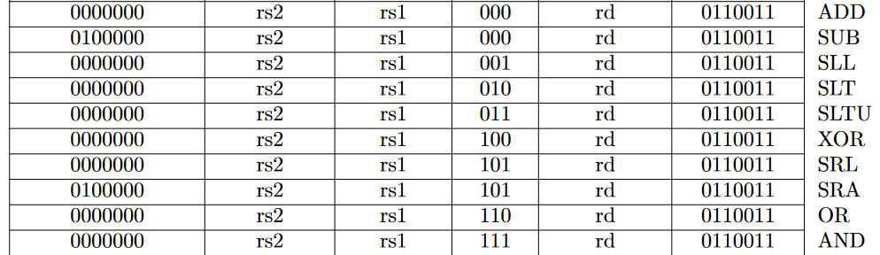
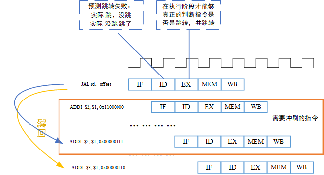

# 1 概览
## 1 overview


### features
- RV32I（40条指令）（32位通用寄存器,基础整数指令集）
- 拓展指令Ｍ，乘除拓展（4条乘法，2条除法，2条取余），试商法实现除法运算
- 仅支持机器模式（Machine Mode）
- 采用静态预测机制
- 单周期
- 按序发射按序执行按序写回的五级流水线 
- 配备完整的ITCM 和DTCM(Sram)
- verilog 2001语法编写
- 支持JTAG调试
- IP模块包括：中断控制器、计时器（TImer）、UART、SPI
- 模块与模块的接口均采用严谨的 valid-ready 握手接口
- ECC保护sram(?)
- 总线选择ICB(Internal Chip Bus,蜂鸟e203的总线）
- 存储接口：
	- 私有的 ITCM（指令紧耦合存储64bit）与 DTCM（数据紧耦合存储32bit），实现指令与数据的分离存储同时提高性能。(使用不同的总线访问)？？
	- 总线用于访存指令或者数据。？？
	- 中断接口用于与 SoC 级 别的中 断控制器 连接。
	- 紧耦合的私有外设接口，用于访存数据。可以将系统中的私有外设直接接到此接口 上，使得处理器核无须经过与数据和指令共享的总线便可访问这些外设。？？
	- 紧耦合的快速 I/O 接口，用于访存数据。可以将系统中的快速 I/O 模块直接接到此接 口上，使得处理器核无须经过与数据和指令共享的总线便可访问这些模块。？？
	- 所有的 ITCM、DTCM、系统总线接口、私有外设接口以及快速 I/O 接口均可以配置 地址区间。？？

## 2编码风格及注意要点
- 统一采用Verilog RTL编码风格
- 使用标准 DFF 模块例化生成寄存器。(带有 reset 的寄存器面积和时序会稍微差一点, ，因此在数据通路上可以使用不带 reset 的寄存器，而只在控制通路上使用带 reset 的寄存器)
- 推荐使用 Verilog 中的 assign 语法替代 if-else 和 case 语法进行代码编写。
- 由于带有 reset 的寄存器面积和时序会稍微差一点 ，因此在**数据通路**上可以使用不带 reset 的寄存器，而只在**控制通路**上使用带 reset 的寄存器。
- 
### DFF
标准DFF例化的好处
- 便于全局替换寄存器类型
- 便于在寄存器中全局插入延迟
- 明确的 load- enable 使能信号方便综合工具自动插入寄存器级的门控时钟以降低动态功耗
- 便于规避 Verilog 语法 if-else 、case不能传播不定态的问题


## 3 Deilt_RISC core
### features
本项目拟设计一个五级流水的单核32位处理器（Deilt_RISC），采用Verilog编写。其具有以下特点：

- 按序发射按序执行按序写回的五级流水线
- 采用静态预测机制
- RV32I（40条指令）（32位通用寄存器,基础整数指令集）
- 拓展指令Ｍ，乘除拓展（4条乘法，2条除法，2条取余），试商法实现除法运算
- 仅支持机器模式（Machine Mode）
- 配备完整的ITCM 和DTCM(Sram)
- verilog 2001语法编写
- 支持中断
- 模块与模块的接口均采用严谨的 valid-ready 握手接口
- IP模块包括：中断控制器、计时器（TImer）、UART、SPI
- 支持JTAG调试
- 未完待续。。。
- 
### Hierarchy


# 2 搭建数据通路（RV32I，Base Integer Instructions，40条）


## 2.1 I 型指令的实现
### I型指令介绍


- I型指令通常包括
	- opcode（操作码，7）
	- funct3（功能码，3）
	- rs1（源寄存器1，5）
	- rd（目标寄存器，5）
	- Imm（立即数，12）
	- shamt（位移次数，5）(因为是32位数据，所以最多只能位移32次，5位位宽即可)
	其中opcode用于判断指令的类型；func3用于判断具体指令需要进行的操作；rs1是需要访问通用寄存器的地址，将取到的值用于运算操作；rd是将运算结果写回的目的寄存器地址，立即数是进行运算操作的数，这里直接给出，可以直接扩展后使用，不需要访问寄存器取值。

通过上图我们可以看到I型指令的其中9种类型。下面我会一一解释。

```
`ADDI`
- addi rd, rs1, imm
- rd = rs1 + imm
- 将符号扩展的立即数imm的值加上rs1的值，结果写入rd寄存器，忽略算术溢出。
```

```
`ORI`
- ori rd, rs1, imm
- rd = rs1 | imm
- 将rs1的值与符号扩展的立即数imm的值按位或，结果写入rd寄存器，忽略算术溢出。
```

```
`XORI`
- xori rd, rs1, imm
- rd = rs1 ^ imm
- 将rs1与符号位扩展的imm按位异或，结果写入rd寄存器。
```

```
`ANDI`
- andi rd, rs1, imm
- rd = rs1 & imm
- 将rs1与符号位扩展的imm按位与，结果写入rd寄存器。
```

```
`SLLI` shift left logical imm
- slli rd, rs1, shamt
- rd = rs1 << imm
- 将rs1左移shamt位，空出的位补0，结果写入rd寄存器
```

```
`SRLI` shift right logical imm 
- srli rd, rs1, shamt
- rd = rs1 >> imm
- 将rs1右移shamt位，空出的位补0，结果写入rd寄存器
```

```
`SRAI` shift right arith imm(算术位移)
- srai rd, rs1, shamt
- rd = rs1 >> imm
- 将rs1右移shamt位，空出的位用rs1的最高位补充，结果写入rd寄存器
```

```
`SLTI` set less than imm 
- slti rd, rs1, imm
- rd = (rs1 < imm) ? 1:0 ;
- 将符号扩展的立即数imm的值与rs1的值比较(有符号数比较)，如果rs1的值更小，则向rd寄存器写1，否则写0。
```

```
`SLTIU` set less than imm(u)
- sltiu rd, rs1, imm
- rd = (rs1 < imm) ? 1:0 ;
- 将符号扩展的立即数imm的值与rs1的值比较(无符号数比较)，如果rs1的值更小，则向rd寄存器写1，否则写0。
```


### I型指令数据通路图
数据通路的建立如图所示。

- PC是程序计数器，用于指出指令的地址，即ROM的地址。
- 程序存储在ROM中，目前用ROM代替。
- EX用于进行运算
- RAM是访存会用到的寄存器，目前没有用，可忽略
- WB是将运算结果写回reg（32位通用寄存器，可参考“寄存器”文档）

其中，if_id,id_ex,ex_mem,mem_wb模块均为时序逻辑，信号使用带load_enable使能信号，复位为默认值的寄存器例化模块。
### verilog代码实现
#### define
```
`define CpuResetAddr    32'h0
`define RstEnable       1'b0 
`define True            1'b1
`define False           1'b0

//INST
`define INST_NOP 32'h00000013
`define ZeroWord 32'h0 

//ROM 
`define InstBus         31:0         //ROM的数据总线宽度
`define InstWidth       32
`define InstAddrBus     31:0         //ROM的地址总线宽度
`define InstAddrWidth   32
`define InstMemNum      131071       //ROM的实际大小为128KB
`define InstMemNumLog2  17           //ROM实际使用的地址宽度

//RAM MEM
`define MemBus          31:0
`define MemAddrBus      31:0
`define MemWidth        32
`define MemAddrWidth    32
`define MemDepth        131071
`define MemBank         2
`define MemUnit         4

//reg
`define RegAddrBus      4:0          //reg的地址总线宽度
`define RegAddrWidth    5
`define RegBus          31:0         //reg的数据总线宽度
`define RegWidth        32           //reg的宽度
`define RegDepth        32           //reg number 
`define RegNum          32           //reg number 
`define RegNumLog2      5            //寻址reg使用的地址位数
`define ZeroRegAddr     5'b00000     //zero reg
`define ZeroReg         32'h00000000

`define WriteEnable     1'b1
`define WriteDisable    1'b0
`define ReadEnable      1'b1
`define ReadDisable     1'b0

// I type inst
`define INST_TYPE_I 7'b0010011
`define INST_ADDI   3'b000  //addi rd,rs1,imm            
`define INST_SLTI   3'b010  //SLTI  slti  rd, rs1, imm   $signed(rs1) < $signed(imm) ? 1 : 0
`define INST_SLTIU  3'b011  //sltiu sltiu rd, rs1, imm   rs1 < imm ? 1:0
`define INST_XORI   3'b100
`define INST_ORI    3'b110
`define INST_ANDI   3'b111

`define INST_SLLI   3'b001  //逻辑左移 SLLI  slli rd, rs1, imm rd = rs1 << imm (低位补0)
`define INST_SRLI   3'b101  //逻辑右移 SRLI  srli rd, rs1, imm rd = rs1 >> imm (高位补0)
`define INST_SRAI   3'b101  //算术右移 符号位填充
```
#### 文件目录
```
Deilt_RISC                                                                             
├─ Arch                                                                                                                                               
├─ book                                                                                                                                    
├─ DC                                                                                  
├─ isa                                                                                 
│  └─ rom_addi_inst_test.txt             //简单的指令测试文件                                              
├─ libs                                                                                
├─ rtl                                                                                 
│  ├─ core                              //riscv_core                                               
│  │  ├─ ex.v                           //执行模块                                               
│  │  ├─ ex_mem.v                       //ex_mem模块                                               
│  │  ├─ id.v                           //译码模块                                               
│  │  ├─ id_ex.v                                                                       
│  │  ├─ if_id.v                                                                       
│  │  ├─ mem.v                          //访存模块                                               
│  │  ├─ mem_wb.v                                                                      
│  │  ├─ pc.v                           //program counter                                               
│  │  ├─ ram.v                          //存储器                                               
│  │  ├─ regfile.v                      //32位通用寄存器                                               
│  │  ├─ riscv_core.v                   //core                                                
│  │  ├─ rom.v                          //rom，用于存储指令                                               
│  │  └─ wb.v                           //写回模块                                               
│  ├─ debug                                                                            
│  ├─ defines                           //定义文件夹                                               
│  │  └─ defines.v                                                                     
│  ├─ general                                                                          
│  │  ├─ gnrl_dffs.v                    //通用D触发器                                               
│  │  ├─ gnrl_ram.v                     //通用SRAM                                               
│  │  ├─ gnrl_ram_2clock.v                                                             
│  │  └─ gnrl_xchecker.v                //不定态检测模块                                               
│  ├─ perips                                                                           
│  └─ soc                                                                              
├─ sdk                                                                                 
├─ sim                                                                                 
├─ tb                                                                                  
│  ├─ 20230310tb_for_i.v                                                               
│  └─ core_tb(addi).v                  //2023-3-13简单测试add的tb模块                                                
├─ tools                                                                               
├─ LICENSE                                                                             
├─ README.md                                                                           
└─ tree.tree                                      
```
#### Module description
- rom，ram模块例化了gnrl_ram,这是一个sram模块，配备了不定态检测，可以将x强制设为零。其中，读写均在一个时钟周期内完成。同时支持不对齐写入数据。
- 各个流水线寄存器均使用gnrl_dffs里面的模块例化，便于全局替换及插入延时；带有load_enable端口，便于综合工具自动插入寄存器级的门控时钟以降低动态功耗。
- pc采用的是字节寻址，所以pc+4，rom，ram需对输入的地址除以4
- 其他请详见代码
#### testbench for ADD
```
`timescale  1ns/1ps
module core_tb;
    reg clk ;
    reg rstn ;

    //initial
    initial begin
        #0 ;
        clk = 0 ;
        rstn = 0 ;

        #40 ;
        rstn = 1 ;
    end

    //clk gen
    always #10 clk = ~clk ;

    //rom
    initial begin
        $readmemb("../isa/addi.txt",core_tb.u_riscv_core.u_rom.u_gnrl_rom.mem_r);//for sim dir
    end
    //display
    initial begin
        //$readmemb("./rom_addi_inst_test.data",riscv_core.u_rom.u_gnrl_rom.mem_r);
        $display("rom_memb[0] rom_memb value is %b",core_tb.u_riscv_core.u_rom.u_gnrl_rom.mem_r[0]);
        $display("rom_memb[1] rom_memb value is %b",core_tb.u_riscv_core.u_rom.u_gnrl_rom.mem_r[1]);
        $display("rom_memb[2] rom_memb value is %b",core_tb.u_riscv_core.u_rom.u_gnrl_rom.mem_r[2]);


        #100;
        $display("x27 regs value is %d",core_tb.u_riscv_core.u_regfile.regs_mem[27]);
        $display("x28 regs value is %d",core_tb.u_riscv_core.u_regfile.regs_mem[28]);
        $display("x29 regs value is %d",core_tb.u_riscv_core.u_regfile.regs_mem[29]);
        #1000;
        $display("x27 regs value is %d",core_tb.u_riscv_core.u_regfile.regs_mem[27]);
        $display("x28 regs value is %d",core_tb.u_riscv_core.u_regfile.regs_mem[28]);
        $display("x29 regs value is %d",core_tb.u_riscv_core.u_regfile.regs_mem[29]);
        #100 $finish;
    end

    //inst
    riscv_core u_riscv_core(
        .clk(clk),
        .rstn(rstn)
    );
    //stop

endmodule
```
### 编译仿真结果

从图中可以看出，这是典型的五级流水，各个模块正常，没有问题。写进rom的数据在流水线中正确运行，reg中分别写入了数据，符合设计期望。

### 流水线冒险

由上可知已经建立了五级流水线，到此为止，它是一个十分简单的流水线，但是它解决不了实际中遇到的一些问题。所以现在必须面对的问题是流水线冒险，在流水线正常运行的过程中，会遇到一些相关性的问题，这些问题会造成指令在运行的某个阶段产生错误，以致整条流水线出错。

#### 流水线数据相关性

`结构冒险`： 因**缺乏硬件**支持而导致指令不能在预定的时钟周期内执行的情况。即，硬件不支持多条指令在同一时钟周期执行。

`数据冒险`： 因无法提供指令执行所需的**数据**而导致指令不能在预定的时钟周期内执行。即，一条指令依赖于前面一条尚在流水线中指令。

- 解决方法：前递，不需要等待指令完成就可以尝试解决数据冒险。
  - 其中，数据冒险又有RAW，WAR，WAW
  - RAW是此条流水线必须会遇到的情况。我们主要解决RAW。

`控制冒险`(分支冒险)： 由于取到的指令不是所需要的，或者指令地址的流向不是流水线所预期的，导致**正确的指令**无法在正确的时钟周期内执行。

- 解决方法：停顿、预测、延迟转移（放一条不受影响的指令

#### 数据冒险（RAW）情况与解决（load冒险先不考虑）

`发生冒险的三种情况`

- **相邻指令**间存在数据相关

>
>
>上图中，第一条指令需要将执行的结果写回reg的\$1中，但是第二条指令需要读$1。第一条指令在wb阶段最后一个时钟上升沿才能写\$1，所以第二条指令从reg中读出的数据是错误的，且执行结果也是错误的。

- **相隔1条**指令间存在数据相关

>
>
>第一条指令需要将执行的结果写回reg的\$1中，但是第三条指令需要读寄存器$1。此时第一条指令处于访存阶段，所以得到的值是错误的。

- **相隔2条**指令间存在数据相关

>
>
>此时，第一条指令需要将执行的结果写回reg的\$1中，相对于第四条指令的译码阶段，第一条指令处于写回阶段，但是第四条指令需要读寄存器$1，所以得到的是错误的值。
>
>这种情况下，对于第一条指令，此时处于写回阶段，且其端口的写数据、地址、写使能连接的是reg，因此，可以在reg模块中将数据直接传递给处于译码阶段的第四条指令。


`解决方法`

- **插入气泡**

  - 当检测到相关后，在流水线中插入气泡，暂停一些周期。
  - 

- **编译器调度**

  - 编译器检测到相关后，可以改变部分无关指令的**执行顺序**，从而去除数据相关的影响。

- **数据前递**

  - 将计算出的结果直接送到其他指令所需要处，避免流水线暂停。
  - 但是，对于load指令，所需要的数据没有在执行阶段产生，而是在访存阶段产生。这种情况后面给出解决方案。
  - 

  

#### 解决数据冲突流水线


代码修改请自行参考RTL目录。

1. 修改regfile，将wb写回的数据地址，与此时读regfile的地址对比，如果相同，则将wb写回的数据赋值给读端口。同时添加了读使能。
2. 修改ID模块。
3. 修改riscv_core模块。

##### 仿真测试

###### 仿真测试tb

```verilog
`timescale  1ns/1ps
module core_tb;
    reg clk ;
    reg rstn ;

    //initial
    initial begin
        #0 ;
        clk = 0 ;
        rstn = 0 ;

        #40 ;
        rstn = 1 ;
    end

    //clk gen
    always #10 clk = ~clk ;

    //rom
    initial begin
        $readmemb("../isa/rom_addi_inst_test_relation.txt",core_tb.u_riscv_core.u_rom.u_gnrl_rom.mem_r);//for sim dir
    end
    //display
    initial begin
        //$readmemb("./rom_addi_inst_test.data",riscv_core.u_rom.u_gnrl_rom.mem_r);
        $display("rom_memb[0] rom_memb value is %b",core_tb.u_riscv_core.u_rom.u_gnrl_rom.mem_r[0]);
        $display("rom_memb[1] rom_memb value is %b",core_tb.u_riscv_core.u_rom.u_gnrl_rom.mem_r[1]);
        $display("rom_memb[2] rom_memb value is %b",core_tb.u_riscv_core.u_rom.u_gnrl_rom.mem_r[2]);
        $display("rom_memb[3] rom_memb value is %b",core_tb.u_riscv_core.u_rom.u_gnrl_rom.mem_r[3]);
        $display("rom_memb[4] rom_memb value is %b",core_tb.u_riscv_core.u_rom.u_gnrl_rom.mem_r[4]);
        $display("rom_memb[5] rom_memb value is %b",core_tb.u_riscv_core.u_rom.u_gnrl_rom.mem_r[5]);


        #1000;
        $display("x1 regs value is %d",core_tb.u_riscv_core.u_regfile.regs_mem[1]);
        $display("x2 regs value is %d",core_tb.u_riscv_core.u_regfile.regs_mem[2]);
        $display("x3 regs value is %d",core_tb.u_riscv_core.u_regfile.regs_mem[3]);
        $display("x4 regs value is %d",core_tb.u_riscv_core.u_regfile.regs_mem[4]);
        $display("x5 regs value is %d",core_tb.u_riscv_core.u_regfile.regs_mem[5]);
        //$display("x29 regs value is %d",core_tb.u_riscv_core.u_regfile.regs_mem[29]);
        #100 $finish;
    end

    //inst
    riscv_core u_riscv_core(
        .clk(clk),
        .rstn(rstn)
    );
endmodule
```


##### 测试结果


## 2.2 R型指令的实现

### R型指令介绍




R型指令通常包括

- opcode（操作码，7）
- funct3（功能码，3）
- rs1（源寄存器1，5）
- rs2（源寄存器1，5）
- rd（目标寄存器，5）
- funct7（功能码，7）
  其中opcode用于判断指令的类型与M拓展指令相同（0110011）；funct7用于进一步分辨是R型还是M拓展指令，func3用于判断具体指令需要进行的操作；rs1是需要访问通用寄存器的地址，将取到的值用于运算操作；rs2也是需要访问通用寄存器的地址，将取到的值用于运算操作；rd是将运算结果写回的目的寄存器地址。


通过上图我们可以看到R型指令有10种类型。下面我会一一解释。

```c
`ADD`
- ADD rd，rs1，rs2
- x[rd] = x[rs1] + x[rs2]
- 将rs1寄存器的值加上rs2寄存器的值，然后将结果写入rd寄存器里，忽略算术溢出。
```

```
`SUB`(subtract)
- sub rd, rs1, rs2
- x[rd] = x[rs1] - x[rs2]
- 将rs1寄存器的值减去rs2寄存器的值，然后将结果写入rd寄存器里，忽略算术溢出。
```

```c
`SLL`（shift left logical）
- sll rd, rs1, rs2
- x[rd] = x[rs1] << x[rs2]
- 将rs1左移rs2位(低5位有效)，空出的位补0，结果写入rd寄存器。
```

```
`SLT`（set less than）
- slt rd, rs1, rs2
- x[rd] = (x[rs1] <  x[rs2])? 1:0
- 将rs1的值与rs2的值比较(有符号数比较)，如果rs1的值更小，则向rd寄存器写1，否则写0。
```

```c
`SLTU`（set less than unsigned）
- sltu rd, rs1, rs2
- x[rd] = (x[rs1] <  x[rs2])? 1:0
- 将rs1的值与rs2的值比较(无符号数比较)，如果rs1的值更小，则向rd寄存器写1，否则写0。
```

```
`XOR`（exclusive or）
- xor rd, rs1, rs2
- x[rd] = x[rs1] ^ x[rs2]
- 将rs1与rs2按位异或，结果写入rd寄存器
```

```c
`SRL`（shift right logical）
- srl rd, rs1, rs2
- x[rd] = x[rs1] >> x[rs2]
- 将rs1右移rs2位(低5位有效)，空出的位补0，结果写入rd寄存器。
```

```
`SRA`（shift right arithmetic）
- sra rd, rs1, rs2
- x[rd] = x[rs1] >> x[rs2]
- 将rs1右移rs2位(低5位有效)，空出的位用rs1的最高位补充，结果写入rd寄存器。
```

```c
`OR`（or）
- or rd, rs1, rs2
- x[rd] = x[rs1] | x[rs2]
- 将rs1与rs2按位或，结果写入rd寄存器
```

```
`AND`（and）
- and rd, rs1, rs2
- x[rd] = x[rs1] + x[rs2]
- 将rs1与rs2按位与，结果写入rd寄存器。
```


### R型指令数据通路图


### verilog代码实现

- 补全R型指令
- 修改了regfile里面的赋值情况(bug)
- 修改了ID，EX模块
- 代码请参考`rtl_history/rtl_20230316_pipeline_m_inst`文件夹

### 编译仿真结果

- R型指令测试用例：

  ```
  000000000001_00000_000_00001_0010011 //addi $1,$0,1
  000000000010_00000_000_00010_0010011 //addi $2,$0,2
  000000000011_00000_000_00011_0010011 //addi $3,$0,3
  000000000100_00000_000_00100_0010011 //addi $4,$0,4
  000000000101_00000_000_00101_0010011 //addi $5,$0,5
  000000000110_00000_000_00110_0010011 //addi $6,$0,6
  //test R inst
  //add 0000000_rs2_rs1_000_rd_0110011
  0000000_00010_00001_000_00111_0110011 //add $7,$1,$2
  0100000_00010_00011_000_01000_0110011//sub $8,$3,$2
  0000000_00001_00011_001_01001_0110011//SLL $9,$3,$1
  0000000_00100_00011_010_01010_0110011//SLT $10,$3,$4
  0000000_00100_00011_100_01011_0110011//XOR $11,$3,$4
  0000000_00001_00011_101_01100_0110011//SRl $12,$3,$1
  0100000_00001_00011_101_01101_0110011//SRA$13,$3,$1
  0000000_00001_00011_110_01110_0110011//OR $14,$3,$1
  0000000_00001_00011_111_01111_0110011//AND $15,$3,$1
  ```

- 仿真结果

  - tb文件参考`tb_history/tb_20230316_pipeline_m_inst/core_tb.v`
  - 仿真问价参考`sim_history/sim_20230316_pipeline_m_inst`

  

  

## 2.3 流水线暂停

在流水线进行的过程中，由于乘法、除法、访存等指令可能在执行阶段或者访存阶段需要占用多个时钟周期，因此需要暂停流水线。

本设计中，执行阶段的乘法、除法指令（RV32M）需要多个时钟周期，但是访存阶段的访存指令能够在一个时钟周期内完成读写操作，所以不考虑访存阶段的流水线暂停。暂停信号仅由执行阶段发出。

具体的实现方法如下：

- 假如，位于流水线执行阶段的指令需要多个时钟周期，进而请求流水线暂停
- 那么，需要保持取指地址PC不变
- 同时保持流水线当前阶段（执行阶段）不变，同时，之前的各个阶段的寄存器不变，
- 当前阶段的后面的指令继续进行。


因此，添加CTRL模块，作用是接受各个阶段传递过来的流水线暂停请求信号。从而控制力流水线各阶段的运行。

为了实现流水线暂停机制，对系统结构作了如下修改。


执行阶段向CTRL模块发出流水线暂停请求，由CTRL模块产生流水线暂停信号，输出到PC、IF/ID、ID/EX、EX/MEM、MEM/WB等模块，从而控制PC的值，以及流水线各个阶段的寄存器。

`如果在执行阶段遇到一条除法指令，且除法操作需要33个时钟周期才能完成,执行流程如图所示`

- 在执行阶段遇到除法指令时，首先暂停流水线，同时记录执行阶段的指令PC地址。
- 由于在下一个时钟周期EX阶段无法给出结果，所以EX_MEM阶段也要暂停流水线，即下一个时钟周期给出一个空指令操作。而MEM，WB对应的第一条，第二条指令能够继续完成他们的操作。
- 当执行阶段的除法指令完成时，流水线恢复。
- 将原来除法指令的下一条指令作为开始流水线操作。


### RTL实现

- 添加ctrl模块
  - hold_en[0]表示PC地址是否保持不变，１表示不变
  - hold_en[1]表示if_id阶段是否暂停，１表示暂停
  - hold_en[2]表示id_ex阶段是否暂停，１表示暂停
  - hold_en[3]表示ex_mem阶段是否暂停，１表示暂停
  - hold_en[4]表示mem_wb阶段是否暂停，１表示暂停
- 修改pc, ex, if_id, id_ex, ex_mem, mem_wb模块
- 修改riscv_core
- 代码请参考rtl_history/rtl_20230317_ctrl


## 2.4 分支预测

> 对于没有配备硬件分支预测器的低端 CPU ，为了保证其性能， RISC-V 的架构明确要求采用默认的静态分支预测机制，即如果是向后跳转的条件跳转指令，则预测为“跳”；如果是向前跳转的条件跳转指令，则预测为“不跳”，并且RISC-V 架构要求编译器也按照这种默认的静态分支预测机制来编译生成汇编代码，从而让低端的 CPU 也得到不错的性能。   
> 在低端的 CPU 中，为了使硬件设计尽量简单， RISC-V 架构特地定义了所有的带条件跳转指令跳转目标的偏移量（相对于当前指令的地址〉都是有符号数，并且其符号位被编码在固定的位置。因此这种静态预测机制在硬件上非常容易实现，硬件译码器可以轻松地找到固定的位置，判断该位置的比特值为 1，表示负数（反之则为正数〉。根据静态分支预测机制， 如果是负数，则表示跳转的目标地址为当前地址减去偏移量，也就是向后跳转，则预测为 “跳”。 当然，对于配备有硬件分支预测器的高端 CPU ，则还可以采用高级的动态分支预测机制来保证性能。

###  2.4.1 处理分支指令（分支预测，预测取指）

**类型：**

- 1. 无条件跳转/分支指令

    - 无条件直接跳转/分支（jal，通过立即数计算得出跳转地址）
    - 无条件间接跳转分支（jalr，通过访问寄存器索引计算得出跳转地址）


- 2. 带条件跳转/分支

    - 带条件直接跳转/分支
    - 带条件间接跳转/分支

>**问题所在**：理论上指令只有在执行阶段完成之后，才能够解析出最终的跳转结果。假设处理器将取指暂停， 一直等到执行阶段完成才继续取指，则会造成大量的流水线空泡周期，从而影响性能。

`解决办法` ：**分支预测**（Branch Prediction）

- 预测分支指令是否真的需要跳转？简称为预测“方向”。 
- 如果跳转，跳转的目标地址是什么？简称为预测“地址” 。

>```
>预测方向
>```

1. **静态预测**

- 静态预测是最简单的“方向”预测方法，其不依赖于任何曾经执行过的**指令信息**和**历史信息**，而是仅依靠这条分支指令本身的信息进行预测 。
  - 最简单的静态预测方法是总预测分支指令**不会发生跳转**，因此取指单元便总是顺序取分支指令的下一条指令。待执行阶段之后如果发现需要跳转 ，则会**冲刷流水线** (Flush Pipeline ）重新进行取指 。
  - **BTFN 预测** （Back Taken, Forward Not Taken），即对于向后的跳转预测为跳，向前的跳转则预测为不跳 。向后的跳转是指跳转的目标地址（ PC 值）比当前分支指令的 PC 值要小 。这种BTFN方法的依据是在实际的汇编程序中向后分支跳转的情形要多于向前跳转的情形， 譬如常见的 for 循环生成的汇编指令往往使用向后跳转的分支指令。

2. **动态预测**
   - 动态预测是指依赖、已经执行过的指令的**历史信息**和分支指令**本身的信息**综合进行 “方向 ” 预测 。
     - 最简单的分支“方向”动态预测器是**一比特饱和计数器（1-bit Saturating Counter )**。每次分支指令执行之后，便使用此计数器记录上次的“方向”。 其**预测机制**是：下一次分支指令永远采用上次记录的“方向”作为本次的预测 。
     - **两比特饱和计数器（2-bit saturating counter）** 是最常见的分支“方向”动态预测器。(需配合分支目标缓存)

>```
>预测地址
>```

为了能够连续不断地取指，需要预测分支的目标“地址”，常见的技术简述如下 。

1. **分支目标缓存 （Branch Target Buffer, BTB ）**
   - 使用容量有限的**缓存**保存最近执行过的分支指令的 PC 值，以及它们的跳转目标地址。对于后续需要取指的每条 PC 值，将其与 BTB 中存储的各个 PC 值进行比较，如果出现匹配，则预测这是一条分支指令，并使用其对应存储的跳转目标地址作为预测的跳转地址 。
   - BTB 是一种最简单快捷的预测“地址”方法，但是其**缺点**之一是不能将 BTB 容量做到太大， 否则面积和时序都无法接受 。
   - BTB 的另一个**缺点**是对于间接跳转／分支 （indirect Jump/Branch ）指令的预测效果并不理想 。 这主要是由于间接跳转／分支的目标地址是使用寄存器索引的操作数（基地 址寄存器）计算所得，而寄存器中的值随着程序执行可能每次都不一样，因此 BTB 中存储的上次跳转的目标地址并不一定等于本次跳转的目标值 。
2. **返回地址堆栈（ Return Address Stack, RAS ）**
   - 使用容量有限的硬件堆栈（一 种“先进后出”的结构）来存储函数调用的返回地址 。
   - 间接跳转／分支（ Indirect Jump/Branch ）可以用于函数的调用和返回 。 而函数的调用和返回在程序中往往是成对出现的，因此可以在函数调用（使用分支跳转指令）时将当前 PC 值加 4  。 即其顺序执行的下一条指令的 PC 值压入RAS堆栈中，等到函数返回（使用分支跳转指令）时将 RAS 中的值弹出，这样就可以快速地为该函数返回的分支跳转指令预测目标地址 。

   - 当然由于 RAS 的深度有限，如果程序中出现很多次函数嵌套，需要不断地压入堆栈，造成堆栈溢出，则会影响到预测准确率，硬件需要特殊处理该情形 。
3. **间接 BTB （indirect BTB ）**
   - 专门为间接跳转／分支 Cindirect Jump/Branch ）指令而设计的BTB ，它与普通 BTB 类似，存储较多历史目标地址，但是通过高级的索引方法进行匹配（而不是简单的 PC 值 比较），可以说结合了 BTB 和动态两级预测器的技术，能够提供较高跳转目标地址预测成功率 。 但其缺点是硬件开销非常大，只有在高级的处理器中才会使用。

### 2.4.2 预测 VS 没有预测

#### 1 没有预测

在没有预测的情况下，只有在执行阶段才能够判断出是否跳转，同时将跳转地址传递给PC，这会导致两个时钟周期的浪费。

如果在执行阶段产生的跳转判断结果需要经过EX_MEM阶段，才传递给PC，那么将产生三个时钟周期的浪费。

我们这里考虑的是第一种情况，在执行阶段就能够给出判断结果，并给出跳转PC值。


我们可以看到中间有两条指令浪费了,而在跳转指令之后的第三个周期才能够接收到跳转的PC值，并跳转到跳转地址处。

#### 2 有预测

因此，试想如果我们能够更早的判断指令是否是需要跳转的指令，并给出跳转地址，那么，我们将能够再减少一个时钟周期的浪费。

所以，在译码阶段我们对译码的结果进行简单的预测，那么将能够减少一个时钟周期的浪费了。

此RISCV采用的是静态分支预测机制的**BTFN 预测** （Back Taken, Forward Not Taken）。

#### A 预测成功

如果预测成功，那么如图所示，将减少一个时钟周期的浪费。


#### B 预测失败

如果预测失败，实际上是需要跳转的，但是预测没有跳转，那么将在执行阶段纠正给出需要跳转的地址，并冲刷掉其后面的两条指令，那么将造成两条指令的浪费，与没有预测是一样的。


如果预测失败，实际上是不需要跳转的，但是预测跳转了，那么在执行阶段将给出正确的顺序执行的指令地址，且调回原来的地方，并冲刷掉其后面取到的两条指令，将造成两个时钟周期的浪费，与没有预测是一样的情况。




### 2.4.3 实现方式

#### 功能实现（快而连续不断）

- 简单译码(指令是属于普通指令还是分支跳转指令、分支跳转指令的类型和细节)
- 简单的分支预测 (简单的静态预测,默认向回即后跳转，BTFN)
  - 使用pc的加法器,以节省面积
  - 生成跳转判断
  - 生成跳转地址
- PC生成
  - reset后的取指,PC_rtvec
  - 顺序取指,自增取指。
  - 分支指令，使用预测的跳转目标地址。
  - 流水线冲刷，使用ex模块送过来的新pc值。

#### 流水线实现

如图所示，添加了两个模块CTRL和PRDCT模块，一个用于流水线暂停（冲刷），一个用于分支预测。


#### RTL实现

- 添加prdct模块，用于实现静态分支预测，先完成后续的指令实现再完善
- 修改ctrl
- 


## 2.5 跳转指令的实现(JAL=J型,JALR=I型)

### 跳转指令介绍


跳转指令通常包括

- opcode（操作码，7）

- funct3（功能码，3）

- rs1（源寄存器1，5）

- rd（目标寄存器，5）

- Imm（立即数，12）

  其中opcode用于判断指令的类型，func3用于判断具体指令需要进行的操作；rs1是需要访问通用寄存器的地址，将取到的值用于运算操作；rd是将运算结果写回的目的寄存器地址;IMM立即数是进行运算操作的数，这里直接给出，可以直接扩展后使用，不需要访问寄存器取值。

  

通过上图我们可以看到跳转指令有2种类型。下面我会一一解释。

```c
`JAL`(jump and link)
- JAL rd，offset  /   JAL rd，imm
- x[rd] = pc+4; pc += sext(offset)   /   x[rd] = pc+4; pc += imm
- 把下一条指令的地址(PC+4)存入rd寄存器中，然后把PC设置为当前值加上符号位扩展的偏移量
```

```
`JALR`(jump and link reg)
- JALR rd，offset(rs1)   /   JALR rd，(imm)rs1
- x[rd] = pc+4; pc = rs1 + offset   /   x[rd] = pc+4; pc = rs1 + imm
- 将PC设置为rs1寄存器中的值加上符号位扩展的偏移量，把计算出地址的最低有效位设为0，并将原PC+4的值写入rd寄存器.如果不需要目的寄存器，可以将rd设置为x0。
- 将最低有效位设置为0的原因是为了保证跳转地址是4字节对齐的，因为RISCV 32位的指令长度都是4字节的.
```

### 跳转指令数据通路图


### RTL实现

- 修改id，ex，ctrl
- 修改id_ex，prdct
- 待B型指令完成后完善


## 2.6 B型指令的实现

### B型指令介绍


B型指令通常包括

- opcode（操作码，7）

- funct3（功能码，3）

- rs1（源寄存器1，5）

- rs2（源寄存器1，5）

- Imm（立即数，12）

  其中opcode用于判断指令的类型，func3用于判断具体指令需要进行的操作；rs1是需要访问通用寄存器的地址，将取到的值用于运算操作；rs2也是需要访问通用寄存器的地址，将取到的值用于运算操作；;IMM立即数是进行运算操作的数，这里直接给出，可以直接扩展后使用，不需要访问寄存器取值。

  

通过上图我们可以看到分支指令有6种类型。下面我会一一解释。imm/offset

```c
`BEQ`(相等时分支跳转 (Branch if Equal))
- beq rs1, rs2, imm/(offset) 
- if (rs1 == rs2) pc += imm
- 若寄存器 x[rs1]和寄存器 x[rs2]的值相等，把pc的值设为当前值加上符号位扩展的偏移 imm (offset)。
```

```c
`BNE`(不相等时分支跳转 (Branch if Not Equal))
- bne rs1, rs2, imm
- if (rs1 ≠ rs2) pc += imm
- 若寄存器 x[rs1]和寄存器 x[rs2]的值不相等，把 pc 的值设为当前值加上符号位扩展的偏移imm。
```

```c
`BLT`(小于时分支跳转 (Branch if Less Than))
- blt rs1, rs2, imm
- if (rs1 <s rs2) pc += imm
- 若寄存器 x[rs1]的值小于寄存器 x[rs2]的值（均视为二进制补码），把 pc 的值设为当前值加上符号位扩展的偏移 imm
```

```c
`BGE`(大于等于时分支跳转(Branch if Greater Than or Equal))
- bge rs1, rs2, imm
- if (rs1 ≥s rs2) pc += imm
- 若寄存器 x[rs1]的值大于等于寄存器 x[rs2]的值（均视为二进制补码），把 pc 的值设为当前值加上符号位扩展的偏移imm。
```

```c
`BLTU`(无符号小于时分支跳转 (Branch if Less Than, Unsigned))
- bltu rs1, rs2, imm
- if (rs1 <u rs2) pc += imm
- 若寄存器 x[rs1]的值小于寄存器 x[rs2]的值（均视为无符号数），把 pc 的值设为当前值加上符号位扩展的偏移 imm。
```

```c
`BGEU`(无符号大于等于时分支跳转 (Branch if Greater Than or Equal, Unsigned))
- bgeu rs1, rs2, imm
- if (rs1 ≥u rs2) pc += imm
- 若寄存器 x[rs1]的值大于等于寄存器 x[rs2]的值（均视为无符号数），把 pc 的值设为当前值加上符号位扩展的偏移 imm。
```


### B型指令数据通路图


### verilog代码实现

- 修改id，ex模块，添加了B型指令的判断及执行
- 完成ex模块的B型指令补全
- 修改了prdct
- 修改关于共享加法器的模块，pc
- 修改id_ex
- 完成模块修改，修改riscv_core

### 编译仿真结果

- 2023/03/22 


## 2.7 U型指令的实现

### U型指令介绍


U型指令通常包括,

- opcode（操作码，7）

- rd（目的寄存器，5）

- Imm（立即数，20）

  其中opcode用于判断指令的类型;IMM立即数是进行运算操作的数，这里直接给出，可以直接扩展后使用，不需要访问寄存器取值；rd为写回的目的寄存器地址。

  

通过上图我们可以看到U型指令有2种类型。下面我会一一解释。

```c
`LUI`(Load Upper Immediate)
- lui rd, immediate
- x[rd] = sext(immediate[31:12] << 12)
- 20 位立即数 immediate 左移 12 位， 并将低 12 位置零， 写入 x[rd]中。
```

```c
`AUIPC`(Add Upper Immediate to PC)
- auipc rd, immediate
- x[rd] = pc + sext(immediate[31:12] << 12)
- 把符号位扩展的 20 位（左移 12 位）立即数加到 pc 上，结果写入 x[rd]。
```

### rtl代码实现

- 实现U型指令
- 修改了ID，EX模块，mem模块

### 仿真编译结果


## 2.8 访存指令的实现(sotore = S型，load=I型)

### 访存指令介绍


访存指令store(S型)通常包括,load属于I型

- opcode（操作码，7）

- funct3（功能码，3）

- rs1（源寄存器1，5）

- rs2（源寄存器1，5）

- Imm（立即数，13）

  其中opcode用于判断指令的类型，func3用于判断具体指令需要进行的操作；rs1是需要访问通用寄存器的地址，将取到的值用于运算操作；rs2也是需要访问通用寄存器的地址，将取到的值用于运算操作；;IMM立即数是进行运算操作的数，这里直接给出，可以直接扩展后使用，不需要访问寄存器取值。

  

通过上图我们可以看到访存指令有8种类型。下面我会一一解释。offset=imm

```c
`LB`(字节加载 (Load Byte))
- lb rd, offset(rs1)
- x[rd] = sext(M[x[rs1] + sext(offset)][7:0])
- 从地址 x[rs1] + sign-extend(offset)读取一个字节，经符号位扩展后写入x[rd]。
```

```c
`LH`(半字加载 (Load Halfword))
- lh rd, offset(rs1)
- x[rd] = sext(M[x[rs1] + sext(offset)][15:0])
- 从地址 x[rs1] + sign-extend(offset)读取两个字节，经符号位扩展后写入 x[rd]。
```

```c
`LW`(字加载 (Load Word))
- lw rd, offset(rs1)
- x[rd] = sext(M[x[rs1] + sext(offset)][31:0])
- 从地址 x[rs1] + sign-extend(offset)读取四个字节，写入 x[rd]。
```

```c
`LBU`(无符号字节加载 (Load Byte, Unsigned))
- lbu rd, offset(rs1)
- x[rd] = M[x[rs1] + sext(offset)][7:0]
- 从地址 x[rs1] + sign-extend(offset)读取一个字节，经零扩展后写入 x[rd]。
```

```c
`LHU`(无符号半字加载 (Load Halfword, Unsigned))
- lhu rd, offset(rs1)
- x[rd] = M[x[rs1] + sext(offset)][15:0]
- 从地址 x[rs1] + sign-extend(offset)读取两个字节，经零扩展后写入 x[rd]。
```

```c
`SB`(存字节(Store Byte))
- sb rs2, offset(rs1) 
- M[x[rs1] + sext(offset)] = x[rs2][7: 0]
- 将 x[rs2]的低位字节存入内存地址 x[rs1]+sign-extend(offset)。
```

```c
`SH`(存半字(Store Halfword))
- sh rs2, offset(rs1)
- M[x[rs1] + sext(offset) = x[rs2][15: 0]
- 将 x[rs2]的低位 2 个字节存入内存地址 x[rs1]+sign-extend(offset)。
```

```c
`SW`(存字(Store Word))
- sw rs2, offset(rs1)
- M[x[rs1] + sext(offset) = x[rs2][31: 0]
- 将 x[rs2]的低位 4 个字节存入内存地址 x[rs1]+sign-extend(offset)。
```


### 访存指令数据通路图

### verilog代码实现

### 编译仿真结果


# 3 搭建数据通路（RV32M Standard Extension，8条）

### M拓展指令介绍


- M拓展指令通常包括
  - opcode（操作码，7）
  - funct3（功能码，3）
  - rs1（源寄存器1，5）
  - rs2（源寄存器1，5）
  - rd（目标寄存器，5）
  - funct7（功能码，7）
    其中opcode用于判断指令的类型与R型指令相同（0110011）；funct7用于进一步分辨是R型还是M拓展指令，func3用于判断具体指令需要进行的操作；rs1是需要访问通用寄存器的地址，将取到的值用于运算操作；rs2也是需要访问通用寄存器的地址，将取到的值用于运算操作；rd是将运算结果写回的目的寄存器地址。

通过上图我们可以看到M拓展指令有8种类型。下面我会一一解释。

```c
`MUL`（乘(Multiply)）
- mul rd, rs1, rs2
- x[rd] = x[rs1] × x[rs2]
- 把寄存器 x[rs2]乘到寄存器 x[rs1]上，乘积写入 x[rd]。忽略算术溢出。
```

```
`MULH`（高位乘(Multiply High)）
- mulh rd, rs1, rs2
- x[rd] = (x[rs1] s ×s x[rs2]) ≫s XLEN
- 把寄存器 x[rs2]乘到寄存器 x[rs1]上，都视为 2 的补码，将乘积的高位写入 x[rd]。
```

```
`MULHU`（高位无符号乘(Multiply High Unsigned)）
- mulhu rd, rs1, rs2
- x[rd] = (x[rs1]u ×u x[rs2]) ≫u XLEN
- 把寄存器 x[rs2]乘到寄存器 x[rs1]上， x[rs1]、 x[rs2]均为无符号数，将乘积的高位写入 x[rd]。
```

```
`MULHSU`（高位有符号-无符号乘(Multiply High Signed-Unsigned)）
- mulhsu rd, rs1, rs2
- x[rd] = (x[rs1]u ×s x[rs2]) ≫s XLEN
- 把寄存器 x[rs2]乘到寄存器 x[rs1]上， x[rs1]为 2 的补码， x[rs2]为无符号数，将乘积的高位写入 x[rd]
```

```
`DIV`（除法(Divide)）
- div rd, rs1, rs2 
- x[rd] = x[rs1] ÷s x[rs2]
- 用寄存器 x[rs1]的值除以寄存器 x[rs2]的值，向零舍入，将这些数视为二进制补码，把商写入 x[rd]。
```

```
`DIVU`（无符号除法(Divide, Unsigned)）
- divu rd, rs1, rs2
- x[rd] = x[rs1] ÷u x[rs2]
- 用寄存器 x[rs1]的值除以寄存器 x[rs2]的值，向零舍入，将这些数视为无符号数，把商写入x[rd]。
```

```
`REM`(求余数(Remainder))
- rem rd, rs1, rs2
- x[rd] = x[rs1] %s x[rs2]
- x[rs1]除以 x[rs2]，向 0 舍入，都视为 2 的补码，余数写入 x[rd]。
```

```
`REMU`(求无符号数的余数(Remainder, Unsigned))
- remu rd, rs1, rs2
- x[rd] = x[rs1] %u x[rs2]
- x[rs1]除以 x[rs2]，向 0 舍入，都视为无符号数，余数写入 x[rd]。
```


### 除法指令的实现

除法指令采用**试商法**实现。因此，对于32位的除法指令，至少需要32个时钟周期才能dei'da。


### 指令数据通路图


### verilog代码实现


### 编译仿真结果
