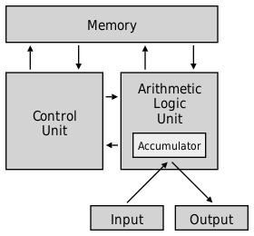
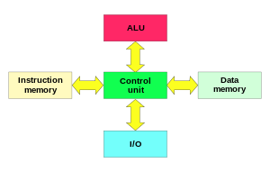

# 存储器架构分类
## 冯·诺依曼结构
- 是一种将`指令存储器`和`数据存储器`**合并**在一起的存储器结构。 程序的指令存储地址和数据存储地址指向同一个存储器的不同物理位置 。

## 哈佛结构
- 是一种将指令存储器和数据存储器**分开**的存储器结构.

>**特点：**
>- 将程序和数据存储在**不同的存储空间**中，即程序存储器和数据存储器是两个独立的 存储器，每个存储器独立编址、独立访问。
>- 与两个存储器相对应的是两条**独立**的**指令总线**和**数据总线**。这种分离的总线使得处 理器可以在一个周期内同时获得指令宇（来自指令存储器)和操作数（来自数据存 储器)，从而提高了执行**速度**和数据的**吞吐率** 。
>- 由于指令和数据存储在两个分开的物理空间中，因此取址和执行能完全**并行**。

# ITCM and DTCM
- 能够保证实时性
	- ITCM 和 DTCM 被映射到不同的地址区间，处理器的访问使用明确的地址映射的方式访问 ITCM 和 DTCM 。
	- 由于 ITCM 和 DTCM 并不是缓存机制，不存在着缓存不命中的情况，其访问的**延迟是明确**可知的，因此程序的执行过程能够得到明确的性能结果 。 在实时性要求高的场景，处理器的反应速度能够取得可靠的实时性 。
- 能够满足软件需求
	- 大多数极低功耗处理器均应用于深嵌入式领域，此领域中的软件代码规模一般较小，所需要的数据段也较小，使用几十 KB 的 ITCM/DTCM便可以满足其需求。
- 面积功耗小
	- 设计简单，面积功耗小。

## ITCM（Instruction Tightly Coupled Memory）指令紧耦合存储器
- 64位数据宽度，低功耗
- 由一块数据宽度为 64 位的单口 SRAM 组成
- 专用总线访问

## DTCM（DataTightly Coupled Memory）数据紧耦合存储器
- 32位数据宽度
- 由一块数据宽度为 32 位的单口 SRAM 组成
- 专用总线访问

