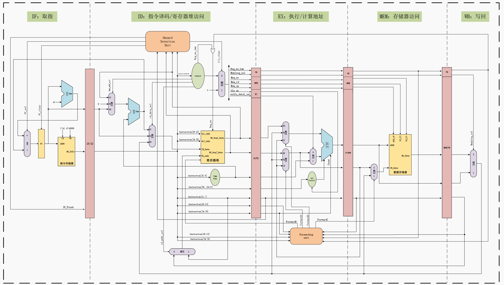

# 1 Introduction
## 1.1 指令集架构与微架构
### 1.1 指令集架构-Instruction Set Architecture,ISA（架构，处理器架构）
- **指令集**：一组指令的集合。cpu硬件和软件之间的接口规范。
- **指令**：处理器进行操作的最小单元。即，一个二进制序列，处理器能够操作运算。
- **指令集架构**：也称指令集或者指令集体系，是计算机体系结构中与程序设计有关的部分，包含基本数据类型，指令集，寄存器，寻址模式，存储体系，中断，异常处理以及外部IO。
### 1.2 微架构（cpu架构）
- **微架构**：处理器的具体硬件实现方案成为微架构。是硬件电路，去实现指令集所规定的操作运算。

### 1.3 CISC and RISC 
- 根据 ISA 的不同可以将计算机分为两类：
	- 复杂指令集计算机（CISC： Complex Instruction Set Computer ）
	- 精简指令集计算机（RISC ： Reduced Instruction Set Computer）。
	- 主要区别是，CISC 的每条指令对应的 0、1 编码串长度不一，而 RISC 的每条指令对应的 0、1 编码串长度是固定的。

### 1.４ ISA分类
主要的ISA也只有几种：x86、ARM、SPARC、POWER、MIPS，除了 x86 是 CISC ISA 外，其余都是 RISC ISA。

## 1.2 RISC-V ISA
### 模块化的指令集（模块化）
| Name       | Description                                                   | Version | Status[b] | Instruction count  |
|:----------:|:-------------------------------------------------------------:|:-------:|:---------:|:------------------:|
| **Base**       |                                                               |         |           |                    |
| RVWMO      | Weak Memory Ordering                                          | 2.0     | Ratified  |                    |
| RV32I      | Base Integer Instruction Set, 32-bit                          | 2.1     | Ratified  | 40                 |
| RV32E      | Base Integer Instruction Set (embedded), 32-bit, 16 registers | 1.9     | Open      | 40                 |
| RV64I      | Base Integer Instruction Set, 64-bit                          | 2.1     | Ratified  | 15                 |
| RV128I     | Base Integer Instruction Set, 128-bit                         | 1.7     | Open      | 15                 |
| **Extension**  |                                                               |         |           |                    |
| M          | Standard Extension for Integer Multiplication and Division    | 2.0     | Ratified  |8 (RV32)   13(RV64) |
| A          | Standard Extension for Atomic Instructions                    | 2.1     | Ratified  |11 (RV32)  22 (RV64)|
| F          | Standard Extension for Single-Precision Floating-Point        | 2.2     | Ratified  |26 (RV32)  30 (RV64)|
| D          | Standard Extension for Double-Precision Floating-Point        | 2.2     | Ratified  |26 (RV32)  32 (RV64)|
| Q          | Standard Extension for Quad-Precision Floating-Point          | 2.2     | Ratified  |28 (RV32)  32 (RV64)|
| C          | Standard Extension for Compressed Instructions                | 2.0     | Ratified  | 40                 |

- `I` 字母表示的指令（RV32I）是最基础的整数指令集，是必须要实现的，使用该指令集，便能够实现完整的软件编译器。拓展部分的指令是可以选择的。
- `M 扩展`：M 扩展即乘除扩展，是 RISC-V 整数乘除标准扩展指令集，包含了有符号和无符号的整数乘除法指令。
- `F 扩展/D 扩展`：F 扩展和 D 扩展两者是分开的，可单独进行选择实现。F 表示单精度浮点标准扩展指令集，D表示双精度浮点标准扩展指令集。它们使用的是 32 个独立的浮点寄存器。
- `A 扩展`：A 扩展表示标准原子扩展。
- `C 扩展`：C 扩展表示标压缩拓展，是 RISC-V 的标准压缩指令集。应用于嵌入式领域。

### 通用寄存器组
- RISC-V架构支持32位或者64位架构，其中RV32表示32位架构，其每个通用寄存器宽度为32比特。
- RISC-V架构的整数通用寄存器组，包含32个（I架构）通用整数寄存器，其中整数寄存器0被预留为常数0。
- 浮点模块（F、Ｄ），则需要另一个独立的浮点寄存器组，包含32个通用浮点寄存器。F模块的浮点寄存器的宽度为32比特，D模块的为64比特。

### 指令编码

### 分支预测
`默认情况下：静态分支预测机制`
>对于没有配备硬件分支预测器的低端 CPU ，为了保证其性能， RISC-V 的架构明确要求 采用默认的静态分支预测机制，即如果是向后跳转的条件跳转指令，则预测为“跳”；如果 是向前跳转的条件跳转指令，则预测为“不跳”，并且阳SC-V 架构要求编译器也按照这种 默认的静态分支预测机制来编译生成汇编代码，从而让低端的 CPU 也得到不错的性能。    
>在低端的 CPU 中，为了使硬件设计尽量简单， RISC-V 架构特地定义了所有的带条件跳 转指令跳转目标的偏移量（相对于当 前指令的地址〉都是有符号数，并且其符号位被编码在固定的位置。因此这种静态预测机制在硬件上非常容易实现，硬件译码器可以轻松地找到固 定的位置，判断该位置的比特值为 l ，表示负数（反之则为正数〉。根据静态分支预测机制， 如果是负数，则表示跳转的目标地址为当前地址减去偏移量，也就是向后跳转，则预测为 “跳”。 当然，对于配备有硬件分支预测器的高端 CPU ，则还可以采用高级的动态分支预测 机制来保证性能。   

### 特权模式
RISC-V 架构定义了 3 种工作模式，又称为特权模式（ Privileged Mode ）。
- Machine Mode ：机器模式，简称 M Mode 。（必选模式）
- Supervisor Mode ：监督模式，简称 S Mode 。 
- User Mode ：用户模式，简称 U Mode 。

### CSR寄存器
`控制和状态寄存器（ Control and Status Register，CSR ）`，用于配置或记录一些运行的状态。CSR 寄存器是处理器核内部的寄存器，**使用自己的地址编码空间**和存储器寻址的地址区间完全无关系 。
CSR 寄存器的访问采用专用的 CSR 指令，包括 CSRRW 、 CSRRS, CSRRC 、 CSRRWI 、 CSRRSI 以及 CSRRCI 指令。

### 中断异常
中断和异常机制往往是处理器指令集架构中最为复杂和关键的部分 。RISC-V 架构定义 了 一套相对简单基本的中断和异常机制，但是也允许用户对其进行定制和扩展 。（手把手13章）

### 矢量指令子集
### 自设计指令扩展（可拓展性）
### RISC-V硬件设计特点
- 仅支持小端格式
- 存储器访问指令一次只访问 一个元素 
- 去除存储器访问指令的地址自增自减模式
- 规整的指令编码格式
- 简化的分支跳转指令与静态预测机制
- 不使用分支延迟槽 (Delay Slot ) 
- 不使用指令条件码（ Conditional Code) 
- 运算指令的结果不产生异常（ Ex ception ) 
- 16 位的压缩指令有其对应的普通 32 位指令 
- 不使用零开销硬件循环

## 1.3 RISC-V软件工具链
软件生态对于CPU是十分重要的，运行在CPU上的软件是CPU的灵魂所在，完备的软件工具链是CPU能够真正运行的第一步。
官网地址：[https://riscv.org/]()

>gitbuh工具链地址：[https://github.com/riscv-software-src/riscv-tools]()      
>`riscv-isa-sim(Spike)` 是一个基于 C/C++ 开发的指令集模拟器。     
>`riscv-pk` 提供 RISC-V 可执行文件运行的程序运行环境，同时提供最简单的 bootloader;   
>`riscv-fesvr`是一个用于实现上位机和 CPU 之间通信机制的库。  
>`riscv-tests`, 是 一组 RISC-V 指令集测试用例。   
>`riscv-opcodes` 模拟器可执行的所有RISC-V操作码,是一个 阳SC-V 操作码信息转换脚本。  
>--------------------------------------  
>riscv-gnu -toolchain 是支持 RISC-V 的 GNU 工具链，包含了以下内容。   
>`riscv-gcc` : GCC 编译器 。   
>`riscv-binutils-gdb` ： 二进制工具（链接器 ， 汇编器等）、 GDB调试工具等。   
>`riscv-glibc` : GNU C 标准库实现 。  

如需使用RISC-V 的工具链，除了按照 GitHub 上的说明下载源代码进行编译生成之外， 还可以直接下载己经预先编译好的 GNU 工具链和 Windows IDE 开发工具 。
## 1.4 需要掌握的知识点
- 熟悉**汇编语言**及其执行过程 。 
- 了解**软件**如何经编译、汇编、链接最后成为处理器可执行的 二进制码的过程 。
- 了解**计算机体系结构**的知识。
-  处理器对时序和面积的要求一般会非常严格，需不断反复地优化时序和面积，因此对电路和逻辑设计的理解需要比较深刻。（verilog语言及电路知识）
# 2 设计部分
## overview
![[附件/Pasted image 20230103191953.jpg]]
![[附件/Pasted image 20230104165629.png]]

### features
- RV32I（40条指令）（32位通用寄存器）
- 拓展指令Ｍ，乘除拓展（4条乘法，2条除法，2条取余）
- 支持机器模式、用户模式、监督模式 ？？ 
- 按序发射按序执行的五级流水线 。？？
- 配备完整的指令 Cache 和数据 Cache 。？？
- verilog 2001语法编写
- 支持JTAG调试 ？？
- IP模块包括：中断控制器、计时器（TImer）、UART、SPI
- 存储接口：
	- 私有的 ITCM（指令紧耦合存储）与 DTCM（数据紧耦合存储），实现指令与数据的分 离存储同时提高性能。？？
	- 总线用于访存指令或者数据。？？
	- 中断接口用于与 SoC 级 别的中 断控制器 连接。
	- 紧耦合的私有外设接口，用于访存数据。可以将系统中的私有外设直接接到此接口 上，使得处理器核无须经过与数据和指令共享的总线便可访问这些外设。？？
	- 紧耦合的快速 I/O 接口，用于访存数据。可以将系统中的快速 I/O 模块直接接到此接 口上，使得处理器核无须经过与数据和指令共享的总线便可访问这些模块。？？
	- 所有的 ITCM、DTCM、系统总线接口、私有外设接口以及快速 I/O 接口均可以配置 地址区间。？？
- 

## 编码风格及注意要点
- 统一采用Verilog RTL编码风格
- 使用标准 DFF 模块例化生成寄存器。
- 推荐使用 Verilog 中的 assign 语法替代 if-else 和 case 语法进行代码编写。
- 由于带有 reset 的寄存器面积和时序会稍微差一点 ，因此在**数据通路**上可以使用不带 reset 的寄存器，而只在**控制通路**上使用带 reset 的寄存器。
- 
### DFF
标准DFF例化的好处
- 便于全局替换寄存器类型
- 便于在寄存器中全局插入延迟
- 明确的 load- enable 使能信号方便综合工具自动插入寄存器级的门控时钟以降低动态功耗
- 便于规避 Verilog 语法 if-else 、case不能传播不定态的问题

![[attachment/Pasted image 20230104184000.png]]

## 低功耗设计
- DFF  明确的 load- enable 使能信号方便综合工具自动插入寄存器级别的门控时钟以降低动态功耗
- 由于带有 reset 的寄存器面积和时序会稍微差一点 ，因此在**数据通路**上可以使用不带 reset 的寄存器，而只在**控制通路**上使用带 reset 的寄存器。
- 
- 
- 
- 
## Pipeline 
## Deilt_RISC core
### features

### Hierarchy

#### Function of each modules
### Configurable
- 五级流水
- 支持RV32IM指令集
- 支持中断
- 支持AMBA总线
- 支持UART、GPIO、SPI、Timer
- ROM
- RAM
- JTAG

![[附件/Pasted image 20230103192037.jpg]]
### Module
#### 1 IF (Instruction Fetch)
>IF阶段的操作是取指令，决定PC的值即ROM的地址，然后从ROM中获取指令。

##### 端口信息

##### 时序
![[附件/Pasted image 20230103210527.png]]
#### 2 ID (Instruction Decode)
>ID阶段对指令进行解码操作，解码出需要的信号（控制信号，地址，立即数，操作数）。
>	数据直通
>	load冒险检测
>	分支判断
![[附件/Pasted image 20230103212321.png]]
##### 端口信息

##### 时序
#### 3 EX (Execution)
>EX阶段主要进行运算和中断检测操作。

##### 端口信息

##### 时序
#### 4 MEM (Memory)
>MEM阶段主要负责内存的访问。
>	需要判断是否对齐

##### 端口信息

##### 时序
#### 5 WB (Write Back)

##### 端口信息

##### 时序
# 3验证部分
## 验证方法
- 用传统的模块级验证手段（例如 UVM 等 〉对处理器的子模块进行验证
- 用人工编写或者随机生成的汇编语言测试用例在处理器上运行进行验证
- 用高等语言（ 如 C、 C＋＋ ）编写的测试用例在处理器上运行进行验证。
## 编译
## 仿真
## 覆盖率

# DC综合
