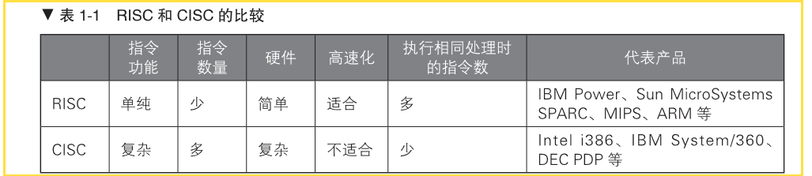
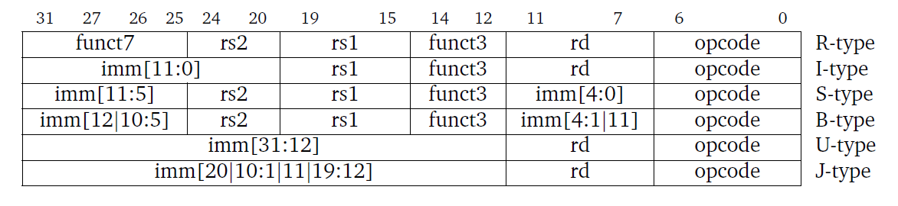
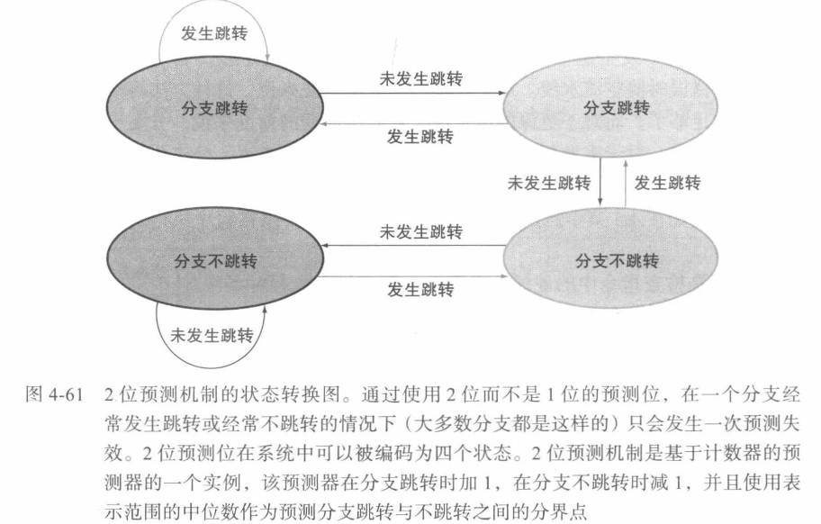
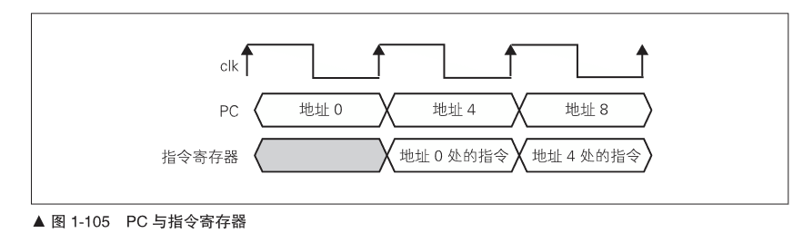

# 1 Introduction
## 1.1 指令集架构与微架构
### 1.1 指令集架构-Instruction Set Architecture,ISA（架构，处理器架构）
- **指令集**：一组指令的集合。cpu硬件和软件之间的接口规范。
- **指令**：处理器进行操作的最小单元。即，一个二进制序列，处理器能够操作运算。
- **指令集架构**：也称指令集或者指令集体系，是计算机体系结构中与程序设计有关的部分，包含基本数据类型，指令集，寄存器，寻址模式，存储体系，中断，异常处理以及外部IO。
### 1.2 微架构（cpu架构）
- **微架构**：处理器的具体硬件实现方案成为微架构。是硬件电路，去实现指令集所规定的操作运算。

### 1.3 CISC and RISC 
- 根据 ISA 的不同可以将计算机分为两类：
    - 复杂指令集计算机（CISC： Complex Instruction Set Computer ）
    - 精简指令集计算机（RISC ： Reduced Instruction Set Computer）。
    - 主要区别是，CISC 的每条指令对应的 0、1 编码串长度不一，而 RISC 的每条指令对应的 0、1 编码串长度是固定的。


### 1.４ ISA分类
主要的ISA也只有几种：x86、ARM、SPARC、POWER、MIPS，除了 x86 是 CISC ISA 外，其余都是 RISC ISA。

## 1.2 RISC-V ISA
### 模块化的指令集（模块化）
| Name       | Description                                                   | Version | Status[b] | Instruction count  |
|:----------:|:-------------------------------------------------------------:|:-------:|:---------:|:------------------:|
| **Base**       |                                                               |         |           |                    |
| RVWMO      | Weak Memory Ordering                                          | 2.0     | Ratified  |                    |
| RV32I      | Base Integer Instruction Set, 32-bit                          | 2.1     | Ratified  | 40                 |
| RV32E      | Base Integer Instruction Set (embedded), 32-bit, 16 registers | 1.9     | Open      | 40                 |
| RV64I      | Base Integer Instruction Set, 64-bit                          | 2.1     | Ratified  | 15                 |
| RV128I     | Base Integer Instruction Set, 128-bit                         | 1.7     | Open      | 15                 |
| **Extension**  |                                                               |         |           |                    |
| M          | Standard Extension for Integer Multiplication and Division    | 2.0     | Ratified  |8 (RV32)   13(RV64) |
| A          | Standard Extension for Atomic Instructions                    | 2.1     | Ratified  |11 (RV32)  22 (RV64)|
| F          | Standard Extension for Single-Precision Floating-Point        | 2.2     | Ratified  |26 (RV32)  30 (RV64)|
| D          | Standard Extension for Double-Precision Floating-Point        | 2.2     | Ratified  |26 (RV32)  32 (RV64)|
| Q          | Standard Extension for Quad-Precision Floating-Point          | 2.2     | Ratified  |28 (RV32)  32 (RV64)|
| C          | Standard Extension for Compressed Instructions                | 2.0     | Ratified  | 40                 |

- `I` 字母表示的指令（RV32I）是最基础的整数指令集，是必须要实现的，使用该指令集，便能够实现完整的软件编译器。拓展部分的指令是可以选择的。
- `M 扩展`：M 扩展即乘除扩展，是 RISC-V 整数乘除标准扩展指令集，包含了有符号和无符号的整数乘除法指令。
- `F 扩展/D 扩展`：F 扩展和 D 扩展两者是分开的，可单独进行选择实现。F 表示单精度浮点标准扩展指令集，D表示双精度浮点标准扩展指令集。它们使用的是 32 个独立的浮点寄存器。
- `A 扩展`：A 扩展表示标准原子扩展。
- `C 扩展`：C 扩展表示标压缩拓展，是 RISC-V 的标准压缩指令集。应用于嵌入式领域。

### 通用寄存器组
- RISC-V架构支持32位或者64位架构，其中RV32表示32位架构，其每个通用寄存器宽度为32比特。
- RISC-V架构的整数通用寄存器组，包含32个（I架构）通用整数寄存器，其中整数寄存器0被预留为常数0。
- 浮点模块（F、Ｄ），则需要另一个独立的浮点寄存器组，包含32个通用浮点寄存器。F模块的浮点寄存器的宽度为32比特，D模块的为64比特。


### 指令编码


### 分支预测
```
默认情况下：静态分支预测机制
```

>对于没有配备硬件分支预测器的低端 CPU ，为了保证其性能， RISC-V 的架构明确要求 采用默认的静态分支预测机制，即如果是向后跳转的条件跳转指令，则预测为“跳”；如果 是向前跳转的条件跳转指令，则预测为“不跳”，并且阳SC-V 架构要求编译器也按照这种 默认的静态分支预测机制来编译生成汇编代码，从而让低端的 CPU 也得到不错的性能。   
>在低端的 CPU 中，为了使硬件设计尽量简单， RISC-V 架构特地定义了所有的带条件跳 转指令跳转目标的偏移量（相对于当 前指令的地址〉都是有符号数，并且其符号位被编码在固定的位置。因此这种静态预测机制在硬件上非常容易实现，硬件译码器可以轻松地找到固 定的位置，判断该位置的比特值为 l ，表示负数（反之则为正数〉。根据静态分支预测机制， 如果是负数，则表示跳转的目标地址为当前地址减去偏移量，也就是向后跳转，则预测为 “跳”。 当然，对于配备有硬件分支预测器的高端 CPU ，则还可以采用高级的动态分支预测 机制来保证性能。   


### 特权模式
RISC-V 架构定义了 3 种工作模式，又称为特权模式（ Privileged Mode ）。
- Machine Mode ：机器模式，简称 M Mode 。（必选模式）
- Supervisor Mode ：监督模式，简称 S Mode 。 
- User Mode ：用户模式，简称 U Mode 。


### CSR寄存器
`控制和状态寄存器（ Control and Status Register， CSR ）`，用于配 置或记录一些运行的状态。CSR 寄存器是处理器核内部的寄存器，**使用自己的地址编码空间**和存储器寻址的地址区间完全无关系 。
CSR 寄存器的访问采用专用的 CSR 指令，包括 CSRRW 、 CSRRS, CSRRC 、 CSRRWI 、 CSRRSI 以及 CSRRCI 指令。

### 中断异常
中断和异常机制往往是处理器指令集架构中最为复杂和关键的部分 。RISC-V 架构定义 了 一套相对简单基本的中断和异常机制，但是也允许用户对其进行定制和扩展 。（手把手13章）

### 矢量指令子集
### 自设计指令扩展（可拓展性）
### RISC-V硬件设计特点
- 仅支持小端格式
- 存储器访问指令一次只访问 一个元素 
- 去除存储器访问指令的地址自增自减模式
- 规整的指令编码格式
- 简化的分支跳转指令与静态预测机制
- 不使用分支延迟槽 (Delay Slot ) 
- 不使用指令条件码（ Conditional Code) 
- 运算指令的结果不产生异常（ Ex ception ) 
- 16 位的压缩指令有其对应的普通 32 位指令 
- 不使用零开销硬件循环

## 1.3 RISC-V软件工具链
软件生态对于CPU是十分重要的，运行在CPU上的软件是CPU的灵魂所在，完备的软件工具链是CPU能够真正运行的第一步。
官网地址：[https://riscv.org/]()

>gitbuh工具链地址：[https://github.com/riscv-software-src/riscv-tools]()
>`riscv-isa-sim(Spike)` 是一个基于 C/C++ 开发的指令集模拟器。
>`riscv-pk` 提供 RISC-V 可执行文件运行的程序运行环境，同时提供最简单的 bootloader;
>`riscv-fesvr`是一个用于实现上位机和 CPU 之间通信机制的库。
>`riscv-tests`, 是 一组 RISC-V 指令集测试用例。
>`riscv-opcodes` 模拟器可执行的所有RISC-V操作码,是一个 阳SC-V 操作码信息转换脚本。
>--------------------------------------
>riscv-gnu -toolchain 是支持 RISC-V 的 GNU 工具链，包含了以下内容。 
>`riscv-gcc` : GCC 编译器 。 
>`riscv-binutils-gdb` ： 二进制工具（链接器 ， 汇编器等）、 GDB调试工具等。 
>`riscv-glibc` : GNU C 标准库实现 。

如需使用RISC-V 的工具链，除了按照 GitHub 上的说明下载源代码进行编译生成之外， 还可以直接下载己经预先编译好的 GNU 工具链和 Windows IDE 开发工具 。
## 1.4 需要掌握的知识点
- 熟悉**汇编语言**及其执行过程 。 
- 了解**软件**如何经编译、汇编、链接最后成为处理器可执行的 二进制码的过程 。
- 了解**计算机体系结构**的知识。
-  处理器对时序和面积的要求一般会非常严格，需不断反复地优化时序和面积，因此对电路和逻辑设计的理解需要比较深刻。（verilog语言及电路知识）

# 2 设计部分

## 2.1 overview


### features
- RV32I（40条指令）（32位通用寄存器,基础整数指令集）
- 拓展指令Ｍ，乘除拓展（4条乘法，2条除法，2条取余），试商法实现除法运算
- 仅支持机器模式（Machine Mode）
- 采用静态预测机制
- 按序发射按序执行按序写回的五级流水线 
- 配备完整的ITCM 和DTCM(Sram)
- verilog 2001语法编写
- 支持JTAG调试
- IP模块包括：中断控制器、计时器（TImer）、UART、SPI
- 模块与模块的接口均采用严谨的 valid-ready 握手接口
- ECC保护sram(?)
- 总线选择ICB(Internal Chip Bus,蜂鸟e203的总线）
- 存储接口：
    - 私有的 ITCM（指令紧耦合存储64bit）与 DTCM（数据紧耦合存储32bit），实现指令与数据的分离存储同时提高性能。(使用不同的总线访问)？？
    - 总线用于访存指令或者数据。？？
    - 中断接口用于与 SoC 级 别的中 断控制器 连接。
    - 紧耦合的私有外设接口，用于访存数据。可以将系统中的私有外设直接接到此接口 上，使得处理器核无须经过与数据和指令共享的总线便可访问这些外设。？？
    - 紧耦合的快速 I/O 接口，用于访存数据。可以将系统中的快速 I/O 模块直接接到此接 口上，使得处理器核无须经过与数据和指令共享的总线便可访问这些模块。？？
    - 所有的 ITCM、DTCM、系统总线接口、私有外设接口以及快速 I/O 接口均可以配置 地址区间。？？

## 2.2编码风格及注意要点
- 统一采用Verilog RTL编码风格
- 使用标准 DFF 模块例化生成寄存器。(带有 reset 的寄存器面积和时序会稍微差一点, ，因此在数据通路上可以使用不带 reset 的寄存器，而只在控制通路上使用带 reset 的寄存器)
- 推荐使用 Verilog 中的 assign 语法替代 if-else 和 case 语法进行代码编写。
- 由于带有 reset 的寄存器面积和时序会稍微差一点 ，因此在**数据通路**上可以使用不带 reset 的寄存器，而只在**控制通路**上使用带 reset 的寄存器。
### DFF
标准DFF例化的好处
- 便于全局替换寄存器类型
- 便于在寄存器中全局插入延迟
- 明确的 load- enable 使能信号方便综合工具自动插入寄存器级的门控时钟以降低动态功耗
- 便于规避 Verilog 语法 if-else 、case不能传播不定态的问题


## 2.3 Deilt_RISC core
### features
本项目拟设计一个五级流水的单核32位处理器（Deilt_RISC），采用Verilog编写。其具有以下特点：

- 按序发射按序执行按序写回的五级流水线
- 采用静态预测机制
- RV32I（40条指令）（32位通用寄存器,基础整数指令集）
- 拓展指令Ｍ，乘除拓展（4条乘法，2条除法，2条取余），试商法实现除法运算
- 仅支持机器模式（Machine Mode）
- 配备完整的ITCM 和DTCM(Sram)
- verilog 2001语法编写
- 支持中断
- 模块与模块的接口均采用严谨的 valid-ready 握手接口
- IP模块包括：中断控制器、计时器（TImer）、UART、SPI
- 支持JTAG调试
- 未完待续。。。
- 
### Hierarchy

### Module
#### 1 IF (Instruction Fetch)
##### 1.1 Description
>`IF阶段`的操作是快而连续不断从存储器中取指令，决定PC（每条指令所处的地址）的值即ROM的地址，然后从ROM中获取指令。  
>   - **非分支跳转指令**，连续按顺序取指即可 pc+4
>   - **分支跳转指令**，判断是否需要跳转，且可以快速的取出新的非连续指令。
>   - **流水线暂停取指**


##### 1.2 如何快速取指
`关键在于：`存储器的读延迟，即保证存储器的读延迟越小越好。
- 片外的 DDR 存储器或者 Flash 存储器可能需要几十个周期的延迟
- 片上的 SRAM 也可能要几个周期的延迟

>为了能够使得处理器核以最快的速度取指，通常使用 **ITCM** 和 **I-Cache** 的方法。
>1. `ITCM （lnstruction Tightly Coupled Memory) `
>   - **指令紧耦合存储器**，是指配置一段较小容量（一般几十KB）的存储器（SRAM），用于存储指令，且在物理上离处理器核很近而专属于处理器核，因此能够取得很小的访问延迟。（一个时钟周期）
>   - ITCM的**优点**：实现简单，容易理解，能够保证实时性。
>   - ITCM的**缺点**：由于使用**地址区间寻址**，因此无法像缓存（ Cache ）那样映射无限大的存储器空间；同时为了保证足够小的访问延迟，无法将容量做到很大；因此 ITCM 只能用于存放容量大小有限的关键程序指令。
>2. `I-Cache (Instruction Cache) `
>   - **指令缓存**，是指利用软件程序的时间局部性和空间局部性，将容量巨大的外部指令存储器空间动态**映射**到容量有限的指令缓存中，可以将访问指令存储器的平均延迟降低到最小。
>   - 由于缓存的容量是有限的，因此访问缓存存在着相当大的不确定性 。一旦**缓存不命中**（ Cache Miss ），则需要从外部的存储器中存取数据，造成较长的延迟 。在实时性要求高的场景中，处理器的反应速度必须有最可靠的实时性。如果使用了缓存，则无法保证这一点。
>   - 大多数极低功耗处理器应用的场景都应用于实时性较高的场景，因此更加倾向于使用**延迟确定**的 ITCM 。
>   

##### 1.3 非对齐指令
不管是从 I-Cache ，还是从 ITCM 中取指令，当处理器取指遇到了一条地址非对 齐的指令，则会为“连续不断”取指造成困难，因为 ITCM 和 I-Cache 的存储单元往往使用 SRAM ，而 SRAM 的读端口往往具有固定宽度。 以宽度为 32 位的 SRAM 为例，其一个时钟周期只能读出一个（地址与 32 位对齐）32 位的数据。假设一条 32 位长的指令处于地址不对齐的位置，则意味着需要分两个时钟周期读出两个 32 位的数据，然后各取其一部分进行拼接成为真正需要的 32 位指令，这样就需要花费至少2个时钟周期才能够取出一条指令来 。

>1. **普通指令非对齐** 
>   - 对于普通指令的按顺序取指（地址连续增长）情形，可以使用剩余缓存（Leftover Buffer) 保存上次取指令后没有用完的比特位，供下次使用。
>       - 假设从ITCM 中取出一个 32 位的指令字，但是只用到了它的低16位，这种情形可能是由于两种原因造成的。 
>           - 只需要使用此次取出的 32 位中的低 16 位和上一次取出的高16位组成了一条32 位指令。 
>           - 这个指令长度本身就是16位宽，因此只需要取出的低16位。
>2. **分支跳转指令非对齐**
>   - 对于分支跳转指令而言，如果跳转的目标地址与 32 位地址边界不对齐，且需要取出一个 32 位的指令字，上述剩余缓存也无济于事了（因为剩余缓存只有在按顺序取指时，才能提前预存上次没有用完的指令宇）。对此 ，常见的实现方式是使用**多体**（ Bank ）化的 SRAM 进行指令存储。以常见的奇偶交错方式为例，使用两块32位宽的 SRAM交错地进行存储，两个连续的32位指令字将会被分别存储在两块不同的 SRAM 中 。
>   - 这样对于地址不与 32 位对齐的指令，则一个周期可以同时访问两块SRAM 取出两个连续的32位指令字，然后各取其一部分进行拼接成为真正需要的 32 位指令。

##### 1.4 处理分支指令（分支预测，预测取指）
**类型：**
- 1. 无条件跳转/分支指令
    - 无条件直接跳转/分支（jal，通过立即数计算得出跳转地址）
    - 无条件间接跳转分支（jalr，通过访问寄存器索引计算得出跳转地址）


- 2. 带条件跳转/分支
    - 带条件直接跳转/分支
    - 带条件间接跳转/分支

>**问题所在**：理论上指令只有在执行阶段完成之后，才能够解析出最终的跳转结果。假设处理器将取指暂停， 一直等到执行阶段完成才继续取指，则会造成大量的流水 线空泡周期，从而影响性能。

`解决办法` ：**分支预测**（Branch Prediction）
- 预测分支指令是否真的需要跳转？简称为预测“方向”。 
- 如果跳转，跳转的目标地址是什么？简称为预测“地址” 。

>```
>预测方向
>```
1. **静态预测**
- 静态预测是最简单的“方向”预测方法，其不依赖于任何曾经执行过的指令信息和历史信息，而是仅依靠这条分支指令本身的信息进行预测 。
    - 最简单的静态预测方法是总预测分支指令**不会发生跳转**，因此取指单元便总是顺序取分支指令的下一条指令。待执行阶段之后如果发现需要跳转 ，则会**冲刷流水线** (Flush Pipeline ）重新进行取指 。
    - **BTFN 预测** （Back Taken, Forward Not Taken），即对于向后的跳转预测为跳，向前的跳转则预测为不跳 。向后的跳转是指跳转的目标地址（ PC 值）比当前分支指令的 PC 值要小 。这种BTFN方法的依据是在实际的汇编程序中向后分支跳转的情形要多于向前跳转的情形， 譬如常见的 for 循环生成的汇编指令往往使用向后跳转的分支指令。
2. **动态预测**
    - 动态预测是指依赖、已经执行过的指令的**历史信息**和分支指令**本身的信息**综合进行 “方向 ” 预测 。
        - 最简单的分支“方向”动态预测器是**一比特饱和计数器（1-bit Saturating Counter )**。每次分支指令执行之后，便使用此计数器记录上次的“方向”。 其**预测机制**是：下一次分支指令永远采用上次记录的“方向”作为本次的预测 。
        - **两比特饱和计数器（2-bit saturating counter）** 是最常见的分支“方向”动态预测器。(需配合分支目标缓存)
            - 




>```
>预测地址
>```

为了能够连续不断地取指，需要预测分支的目标“地址”，常见的技术简述如下 。
1. **分支目标缓存 （Branch Target Buffer, BTB ）**
    - 使用容量有限的**缓存**保存最近执行过的分支指令的 PC 值，以及它们的跳转目标地址。对于后续需要取指的每条 PC 值，将其与 BTB 中存储的各个 PC 值进行比较，如果出现匹配，则预测这是一条分支指令，并使用其对应存储的跳转目标地址作为预测的跳转地址 。
    - BTB 是一种最简单快捷的预测“地址”方法，但是其**缺点**之一是不能将 BTB 容量做到太大， 否则面积和时序都无法接受 。
    - BTB 的另一个**缺点**是对于间接跳转／分支 （indirect Jump/Branch ）指令的预测效果并 不理想 。 这主要是由于间接跳转／分支的目标地址是使用寄存器索引的操作数（基地 址寄存器）计算所得，而寄存器中的值随着程序执行可能每次都不一样，因此 BTB 中存储的上次跳转的目标地址并不一定等于本次跳转的目标值 。
2. **返回地址堆栈（ Return Address Stack, RAS ）**
    - 使用容量有限的硬件堆栈（一 种“先进后出”的结构）来存储函数调用的返回地址 。
    - 间接跳转／分支（ Indirect Jump/Branch ）可以用于函数的调用和返回 。 而函数的调用和返回在程序中往往是成对出现的，因此可以在函数调用（使用分支跳转指令）时将当前 PC 值加 4  。 即其顺序执行的下一条指令的 PC 值压入RAS堆栈中，等到函数返回（使用分支跳转指令）时将 RAS 中的值弹出，这样就可以快速地为该函数返回的分支跳转指令预测目标地址 。

    - 当然由于 RAS 的深度有限，如果程序中出现很多次函数嵌套，需要不断地压入堆栈，造成堆栈溢出，则会影响到预测准确率，硬件需要特殊处理该情形 。
3. **间接 BTB （indirect BTB ）**
    - 专门为间接跳转／分支 Cindirect Jump/Branch ）指令而设计的BTB ，它与普通 BTB 类似，存储较多历史目标地址，但是通过高级的索引方法进行匹配（而不是简单的 PC 值 比较），可以说结合了 BTB 和动态两级预测器的技术，能够提供较高跳转目标地址预测成功率 。 但其缺点是硬件开销非常大，只有在高级的处理器中才会使用。


##### 1.5 设计实现
###### 功能实现（快而连续不断）
- 简单译码(指令是属于普通指令还是分支跳转指令、分支跳转指令的类型和细节)
- 简单的分支预测 (简单的静态预测,默认向回即后跳转)
    - 使用pc的加法器,以节省面积
    - 生成跳转判断
    - 生成跳转地址
- PC生成
    - reset后的取指,PC_rtvec
    - 顺序取指,自增取指。（**字节寻址**）如果是 16 位指令，顺序取指的下一条指令的 PC 为 PC+2 ：如果是32 位指令，则顺序取指的下一条指令的 PC 为 PC+4 。
    - 分支指令，使用预测的跳转目标地址。
    - 流水线冲刷，使用ex模块送过来的新pc值。
- 根据PC的值访问ITCM(面向程序小,嵌入式)或总线
    - ITCM数据宽度为 64 比特的**单口** SRAM 组成（64 位的 SRAM 在物理大小上比32 位的SRAM面积更加紧凑）。且一次读64位，比读两次32位的功耗低。


###### 端口信息

###### 时序


#### 2 ID (Instruction Decode)
##### 2.1 Description
>ID阶段对指令进行解码操作，解码出需要的信号（控制信号，地址，立即数，操作数）。
>   - 读数据，写数据
>   - 数据直通(前递)  
>   - load冒险检测  
>   - 分支判断  


##### 设计实现
- 通过译码出的操作数寄存器索引 (lndex）读取Regfile
- 
###### 功能实现
###### 端口信息
###### 时序
#### 3 EX (Execution)
##### 3.1 Description
>EX阶段主要是根据指令的具体操作类型发射给具体的运算单元进行执行。   
- 常见的运算单元
    - 算术逻辑运算单元（ Arithmetic Logical Unit, ALU），主要负责普通逻辑运算、加减法运算和移位运算等基本运算。
    - 整数乘法单元，主要负责有符号数或无符号数整数的乘法运算。
    - 整数除法单元，主要负责有符号数或无符号数整数的除法运算。
    - 浮点运算单元，主要负责浮点指令的运算。

##### 指令发射、派遣、执行、写回
- `派遣`：表示指令经过译码之后被派发到不同的运算单元的等待队列中的过程。
    - 可分为顺序派遣，乱序派遣
- `发射`：表示指令从运算单元的等待队列中（解决了数据依赖性之后）发射到运算单元开始执行的过程。
    - 可分为顺序发射，乱序发射
    - 根据**每个周期一次能够发射的指令个数**，可以分为“单发射”和“多发射”处理器 。

>**分类：**
>1. `顺序发射，顺序执行，顺序写回`
>   - 性能低，硬件实现简单，面积最小。
>2. `顺序发射，乱序执行，顺序写回`
>   - 由于不同的指令类型往往需要不同的运算单元执行周期，譬如除法指令往往要耗费 几十个周期，而最简单的逻辑运算仅需要一个周期便可由ALU计算出来，因此如果一味地进行顺序执行，则性能太差。
>   - **乱序执行**便是指在指令的执行阶段可以由不同的运算单元同时执行不同的指令，譬 如在除法器执行除法指令期间， ALU 也可以执行其他指令，从而提高性能。
>   - 但是在最终的写回阶段仍然要严格地按顺序写回，因此很多时候运算单元要等待其他的指令先写回而将其运算单元本身的流水线停滞。
>- 3. `顺序发射，乱序执行，乱序写回 `
>   - 重排序缓存（Re-Order Buffer, ROB）
>       - 运算单元一旦执行完毕后，结果就将写回 ROB ，而非直接写回 Regfile ， 最后由 ROB 按顺序写回 Regfile 。
>       - 这是一种典型的乱序写回实现，性能很好，不过这种方案也存在着 ROB 往往因面积过大、数据被腾挪写回两次（先从运算单元到 ROB ，再从 ROB 到 Regfile ）而增加动态功耗的问题 。
>   - 物理寄存器组 （Physical Register File）
>       - 由一个统一的物理寄存器组动态地管理逻辑寄存器组的映射关系，运算单元一旦执行完毕后，就将结果乱序地写回物理寄存器组中 。
>       - 此方法相比上述 ROB 方法而言数据只被腾挪一次，因此更加省电，不过控制也相对更加复杂。
>4. `顺序派遣，乱序发射，乱序执行，乱序写回`
>   - 这种区分了派遣和发射功能的处理器往往属于**高性能的超标量处理器**。
>   - 指令经过译码后被顺序地派遣到不同运算单元的等待队列中，在等待队列中可以有多条指令等待，待哪一条指令先解决了数据依赖性后便可被先发射到运算单元中开始执行，因此其发射是乱序的。
>   - 往往也会配备 ROB 或者统一的物理寄存器组

##### 设计实现
- 将指令派遣（ Dispatch ）给不同的运算单元执行
    - 其所有指令都必须被派遣给 ALU ，并且通过 ALU与交付模块的接口进行交付
    - 派遣模块中还会处理流水线冲突的问题，包括资源冲突和数据相关性造成的数据冲突。
- 普通 ALU 运算 ： 主要负责普通 的 ALU 指 令（ 逻辑运算 ，力口减法，移位等 指令）的 执行。
- 多周期乘除法器 ： 主要负责乘法和 除法指令的执行。
- 访存地址生成 ： 主要负责 Load 、 Store 和“ A ”扩展指令的地址生成。
-  分支预测解析 ： 主要负责 Branch 和 Jump 指 令的结果解析和执行
- 将指令交付
- CSR 读写控制
###### 功能实现
###### 端口信息
###### 时序
#### 4 MEM (Memory Access)
##### 4.1 Description
>MEM阶段主要负责内存的访问（写入或者读出）。   
>   需要判断是否对齐


##### 设计实现
- 
###### 功能实现
###### 端口信息
###### 时序
#### 5 WB (Write Back)
##### 5.1 Description
>WB写回阶段是将指令执行的结果写回通用寄存器组的过程。    
>如果是普通运算指令，该结果值来自于“执行”阶段计算的结果：如果是存储器读指令，该结果来自于“访存”阶段从存储器中读取出来的数据。


##### 设计实现
- 将指令运算的结果写回 Regfile
- 将指令划分为单周期指令和长指令两大类
- 将长指令的“交付”和“写回”分开，使得即便执行了多周期长指令，仍然不会阻 塞流水线，让后续的单周期指令仍然能够顺利地写田和交付。
- 
###### 功能实现
###### 端口信息
###### 时序
#### 6 缓存
#### CLINT(Core Local Interupts Controller)
#### PLIC(Platform Level Interrupt Controller)
- PLIC 全称为平台级别中断控制器（ Platform Level Interrupt Controller ），它 是 RISC-V 架构标准定义的系统中断控制器，主要用于**多个外部中断源**的优先级仲裁和派发 。

#### Commit
