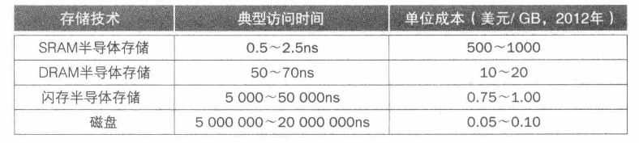

# introduction
- **时间局部性**：如果某个数据项被访问，那么在不久的**将来**他可能再次被访问
- **空间局部性**：如果某个数据项被访问，那么与他**地址相邻**的数据可能很快也被访问。
- **存储层次结构**：多级存储采用的结构，即与处理器的距离越远，存储的容量越大，访问的速度越慢。

- 命中：处理器所需要的数据在本层的存储中找到。
- 命中率：在访问某个存储层次时命中的次数占总访问次数的比例。

# 存储技术

## 静态随机访问存储（Static Ramdom Access Memory,SRAM）
- 常用于靠经处理器的存储层次
- 每比特占用面积比DRAM大

SRAM存储是一种**存储阵列结构**的简单集成电路，通常有一个读写端口。虽然读写操作
的访问时间不同，但对于任意位置的数据，SRAM的**访问时间是固定的**。

SRAM不需要刷新电路，所以访问时间可以和处理器的时钟周期接近。为防止读操作时
信息丢失，典型的SRAM每比特采用6个或8个晶体管来实现。在待机模式下，SRAM只
需要最小的功率来保持电荷。

## 动态随机访问存储（Dynamic Random Access Memory,DRAM）
- 常用于主存
- DRAM相比于SRAM，每比特占用面积远小于SRAM。

在SRAM中，只要提供电源，数值会被一直保存。而在DRAM中，使用**电容**保存电荷的方式来存储数据。采用**单个晶体管**来访问存储的电荷，或者读取它，或者改写它。DRAM的每个比特仅使用单个晶体管来存储数据，它比SRAM的密度更高，每比特价格更低廉。由DRAM在单个晶体管上存储电荷，因此不能长久保持数据，必须进行周期性的**刷新**。与SRAM相比，这也是该结构被称为动态的原因。

为了刷新数据单元，我们只需要读取其中的内容并再次写回，DRAM中的电荷可以保持几微秒。如果每一比特数据都从DRAM中读出再被一一写回，就必须不停进行刷新操作，那么就会没有时间进行正常的数据访问。幸运的是，DRAM使用**两级译码电路**，这使我们可以使用一个读周期紧跟一个写周期的方式一次性完成整行刷新（同一行上的数据共享一条字线)。

### 同步DRAM（Synchronous DRAM，SDRAM）
- 为更好地**优化**与处理器的接口，DRAM添加了**时钟**，因此被称为同步DRAM(Synchronous DRAM,SDRAM)。SDRAM的好处在于，使用**时钟消除了内存和处理器之间的同步问题**。
- 同步DRAM的**速度优势**来自于，进行突发传输(burst transfer)时无须指定额外地址位，而是通过时钟来突发传输后续数据。
- 速度**最快**的结构称为**双倍数据传输率**（Double Data Rate,**DDR**）SDRAM,这名字意味着在时钟的上升沿和下降沿都可以进行数据传输。因此，如果根据时钟频率和数据位宽测算，使用该结构可以获得预想中双倍的数据带宽。
- 
## 闪存（Flash Memory)
- 闪存是一种**电可擦除的可编程只读存储器**(Electrically Erasable Programmable Read-only
Memory,EEPROM)。
- 写操作会产生磨损
- 耗损均衡技术，不一直写同一个地址

## 磁盘（Magnetic Disk）
- 磁性硬盘由一堆盘片组成，这些盘片绕着轴心每分钟转动5400~15000周。这些金属盘片的每一面都被**磁性记忆材料**所覆盖。为从硬盘上读写信息，一个可移动的转臂正位于这些盘面的上方，其中包括一个称为**读写头**的小型电磁线圈。整个驱动器严格密封，以控制驱动器内部的环境，从而使磁头更接近驱动器表面。
- 每个磁盘表面被分为若干的同心圆，称为**磁道（track)**。每个盘面上通常有几万条磁道每条磁道按序划分为上千个保存信息的**扇区（sector)**。扇区的容量一般为512~4096字节。记录在磁介质上的内容依次为：扇区号，间隙，该扇区的信息，下一个扇区的扇区号等等。
- 没有写耗损问题

### 数据访问
1. 第一步，将磁头定位在正确的磁道上方。这个操作称为**寻道（seek）**,将磁头移动到所
需磁道上方的时间称为**寻道时间(seek time)**
2. 一旦磁头到达正确的磁道，我们需要等待所需**扇区**旋转到读写磁头下，这段时间被称为**旋转延时**（rotational latency或rotationaldelay)。
3. 磁盘访问的最后一部分是**传输时间（transfer time)**,即传输数据块(block)的时间。

# cache
