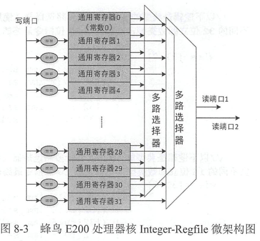
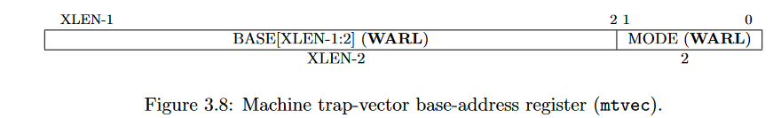
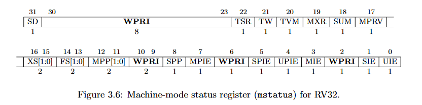
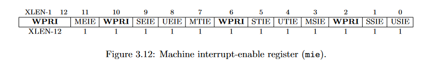

# 整数通用寄存器组（Integer Register File ,Integer-Regfile ）
## 微架构

# 控制和状态寄存器（Control and Status Register, CSR ）
## 进入异常
1. 停止执行当前程序流，转而从 CSR 寄存器 mtvec 定义的 PC 地址开始执行 。
2. 进入异常不仅会让处理器跳转到上述的 PC 地址开始执行 ， 还会让硬件同时更新其他几个CSR 寄存器， 分别是以下4 个寄存器 。
	- 机器模式异常原因寄存器 **mcause** ( Machine Cause Register )
	- 机器模式异常 PC 寄存器 **mepc** (Machine Exception Program Counter )
	- 机器模式异常值寄存器 **mtval** (Machine Trap Value Register )
	- 机器模式状态寄存器 **mstaes** (Machine Status Register)

## register

### mtvec (Machine Trap-Vector Base-Address Register ）

- mtvec 寄存器是一个**可读可写**的 CSR 寄存器 ，因此软件可以编程更改其中的值 。
- 假设 **MODE** 的值为 **0** ，则所有的异常响应时处理器均跳转到 BASE 值指示的 PC 地址。(only)
- 假设 **MODE** 的值为 **1** ，则狭义的**异常**发生时，处理器跳转到 BASE 值指示的 PC 地址：狭义的**中断**发生时，处理器跳转到 BASE+4 * CAUSE 值指示的 PC 地址。
- **CAUSE** 的值表示中断对应的异常编号 CException Code ）。 譬如机器计时器中断（ Machine Timer Interrupt ）的异常编号为 7 ，则其跳转的地址为 BASE+4 × 7=BASE+28= BASE+Oxlc 。

### mcasuse (Machine Cause Register ）
- 用于指示 RISC-V 架构定义的 12 种中断类型和16 种异常类型 。

### mepc(Machine Exception Program Counter)
- 异常的**返回地址**由机器模式异常PC 寄存器mepc 保存

`返回地址`
- **中断**时，中断返回地址mepc的值被更新为**下一条**尚未执行的指令。
- **异常**时，中断返回地址 mepc 的值被更新为**当前**发生异常的指令PC
	- 注意：如果异常由 **ecall** 或 **ebreak** 产生，由于 mepc 的值被更新为ecall 或 ebreak 指 令自己的 PC 。 因此在异常返回时，如果直接使用 mepc 保存的 PC 值作为返回地址，则会再次跳回 ecall 或者 ebreak 指令，从而造成死循环（执行 ecall 或者 ebreak 指令导致重新 进入异常）。**正确的做法**是在异常处理程序中软件改变 mepc 指向**下一条**指令，由于现在 ecall/ebreak 或 （ebreak ）是 4 （或 2 ） 字节指令，因此改写设定mepc=mepc+4 （或＋2 ）即可 。

### mtval（MachineTrap Value Register）
- RISC-V 架构规定，在进入异常时，硬件将自动更新机器模式异常值寄存器 mtval，以反映引起当前异常的**存储器访问地址**或者**指令编码**。
	- 如果是由存储器访问造成的异常，譬如遭遇硬件断点、取指令、存储器读写造成的异常， 则将存储器**访问的地址**更新到 mtval 寄存器中 。
	- 如果是由非法指令造成的异常，则将该指令的**指令编码**更新到 mtval 寄存器中。

### mstatus(Machine Status register)
- RISC-V 架构规定，在进入异常时，硬件将自动更新机器模式状态寄存器的某些域。

- **MIE**域表示在 Machine Mode 下**中断全局使能**。
	- 当该 MIE 域的值为1时，表示 Machine Mode 下所有中断的全局**打开**。
	- 当该 MIE 域的值为0时，表示 Machine Mode 下所有中断的全局**关闭** 。

- ``异常时``
	- **MPIE** 域的值被更新为异常发生**前**MIE 域的值 。
	- **MIE** 的值则被更新成为 **0** （意味着进入异常服务程序后中断被**全局关闭**，所有的中断都将被屏蔽不响应〉。
	- **MPP** 的值被更新为异常发生前的**模式**。 MPP域的作用是在异常结束之后，能够使用 MPP 的值恢复出异常发生之前的工作模式 。 对于只支持机器模式（ Machine Mode Only ）的处理器核，则MPP 的值永远为二进制值 11 。

- `退出异常时`
- mstatus 寄存器**MIE域**的值被更新为当前 MPIE 的值。
- **MPIE** 域的值则被更新为1。

### MIE（Machine Interrupt Enable Registers）

- **MEIE** 域控制机器模式（ Machine Mode）下**外部中断**（ External Interrupt ）的屏蔽。
- **MTIE** 域控制机器模式（ Machine Mode ）下计**时器中断**（ Timer Interrupt ） 的屏蔽。
- **MSIE** 域控制机器模式（ Machine Mode ）下**软件中断**（ Software Interrupt ）的屏蔽。

### MIP

- **MEIP** 域反映机器模式（ Machine Mode ）下的**外部中断**的等待（Pending）状态 。
- **MTIP** 域反映机器模式（ Machine Mode ）下的**计时器中断**的等待（Pending）状态 。
- **MSIP** 域反映机器模式（ Machine Mode ）下的**软件中断**的等待（Pending）状态 。

