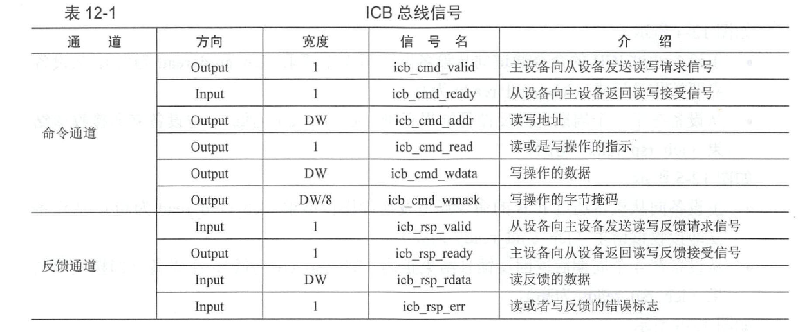
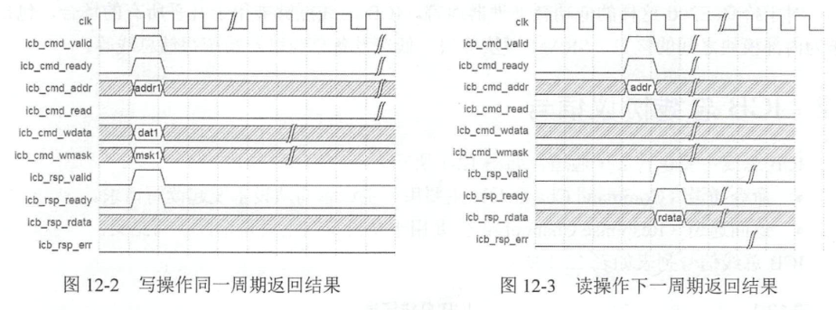
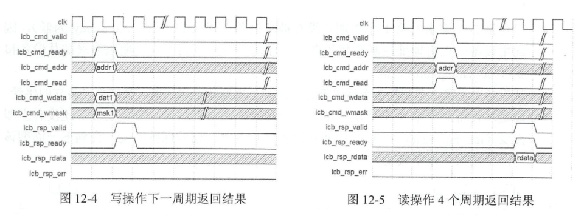
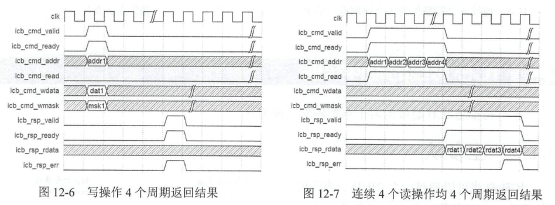
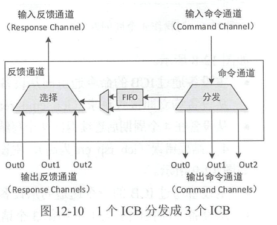

# 总线概述
## AXI
AXI (Advanced eXtensible Interface )是一 种总线协议，是ARM公司提出的AMBA(Advanced Microcontroller Bus Architecture) 3.0 协议中最重要的部分，是一种面向高性能、高带宽 、低延迟的片内总线 。它有如下特点。
- 分离的地址和数据阶段。 
- 支持地址非对齐的数据访问，使用字节掩码（ Byte Strobes ）来控制部分写操作。
- 使用基于突发的交易类型（ Burst-based Transaction ），对于突发操作仅需要发送起始 地址，即可传输大片的数据。 
- 分离的读通道和写通道，总共有 5 个独立的通道 。 
- 支持多个滞外交易（ Multiple Outstanding Transaction ）。
-  支持乱序返回乱序完成 。 
- 非常易于添加流水线级数以获得高频的时序 。
-  AXI 是目前应用最为广泛的片上总线，是处理器核以及高性能 soc 片上总线的事实标准 。
## AHB
- AHB ( Advanced High Performance Bus ）是 ARM 公司提出的 AMBA (Advanced Microcontroller Bus Architec阳re) 2 . 0 协议中 重要的部分，它总共有 3 个通道，具有的特性包 括，单个时钟边沿操作、非三态的实现方式、支持突发传输、支持分段传输以及支持多个主控制器等。
- AHB 总线 是 ARM 公司推出 AXI 总 线之前主要推广的总线，虽然目前高性能的 SOC 中主要使用 AXI 总线，但是 AHB 总线在很多低功耗 SOC中仍然大量使用 。

## APB
- APB (Advanced Peripheral Performance Bus ） 是 ARM 公司提出的 AMBA (Advanced Microcontroller Bus Architecture ）协议中重要的部分 。 APB 主要用于低带宽周边外设之间的 连接，例如 UART 等。它 的总线架构不像 AXI 和 AHB 那样支持多个主模块，在 APB 总线协议中里面唯一 的主模块就是 APB 桥 。其特性包括两个时钟周期传输，无须等待周期和回应信号，控制逻辑简单，只有 4 个控制信号。
- 由于 ARM 公司长时间的推广 APB 总线协议，使之几乎成为了低速设备总线的事实标准，目前很多片上低速设备和 IP 均使用 APB 接口 。

## 总结比较
- AXI 总线是目前应用最为广泛的高性能总线，但是主要应用于高性能的片上总线。 AXI 总线有 5 个通道，分离的读和写通道能够提供很高的吞吐率，但是也需要主设 备（ Master ）自行维护读和写的顺序，控制相对复杂，且经常在 soc 中集成不当造 成各种死锁。同时 5 个通道硬件开销过大，另外在大多数的极低功耗处理器 soc 中都没有使用 AXI 总线。如果蜂鸟 E200 处理器核采用 AXI 总线，一方面增大硬件开销，另一方面会给用户造成负担（需要将 AXI 转换成 AHB 或者其他总线用于低功耗的 SoC ），因此 AXI 总线不是特别适合峰鸟 E200。 这样的极低功耗处理器核。
- AHB总线是目前应用 最为广泛 的高性能低功耗总线， ARM 的 Cortex-M 系列大多数处理器核均采用 AHB 总线。但是 AHB 总线有若干非常明显的局限性，首先其无法像 AXI 总线那样容易地添加流水线级数，其次 AHB 总线无法支持多个滞外交易 (Multiple Outstanding Transaction ），再次其握手协议非常别扭 。将 AHB 总线转换成 其他 Valid-Ready 握手类型的协议（譬如 AXI 和 TileLink 等握手总线接口）颇不容易，跨时钟域或者整数倍时钟域更加困难，因此如果蜂鸟 E200 采用 AHB 总线作为 接口也会带来同样的若干局限性。
- APB 总线是一种低速设备总线，吞吐率比较低，不适合作为主总线使用 ，因此更加 不适用于作为峰鸟 E200 处 理器核的数据总线。
# ICB(Internal Chip Bus)
## feature
- 相比 AXI 和AHB而言， ICB 的协议控制更加简单，仅有**两个独立的通道**。 读和写操作共用地址通道，共用结果返回通道。
- 与 AXI 总线一样，采用**分离**的地址和数据阶段。
- 与 AXI 总线一样，采用**地址区间寻址**，支持任意的**主从数目**，譬如一主一从、一主多从、多主一从、 多主多 从等拓扑结构 。
- 与 AHB 总线 一样，每个读或者写操作都会在地址通道上产生地址，而非像 AXI 中只产生起始地址。
- 与 AXI 总线 一样，支持地址**非对齐**的数据访问，使用**字节掩码**（ Write Mask )来控制部分写操作 。
- 与 AXI 总线 一样，支持多个滞外交易（Multiple Outstanding Transaction）。
- 与 ARB 总线一样，不支持乱序返回乱序完成，反馈通道必须按**顺序返回**结果 。
- 与 AXI 总线一样，非常易于添加**流水线级数**以获得高频的时序 。
- 协议非常简单，易于桥接转换成其他总线类型，譬如 AXI 、 ARB 、 APB 或者 TileLink 等总线 。

## ICB 总线协议信号
>ICB 总线主要包含 **2 个通道**：
- **命令通道（ Command Channel ）** ：主要用于主设备向从设备发起读写请求。
- **返回通道（ Response Channel ）**：主要用于从设备向主设备返回读写结果。

## ICB总线协议时序

## ICB总线的硬件实现
### 一主多从

### 多主一从

### 多主多从

# BIU ICB
