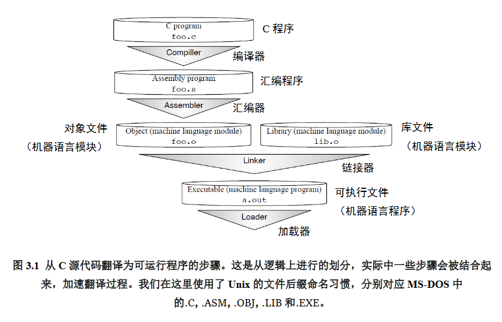

# 1 概述



如何将C/C++语言编写的程序转换成为处理器能够执行的二进制代码？该过程即一般编译原理书籍所介绍的过程，包括四个步骤：

- 预处理（Preprocessing）
- 编译（Compilation）
- 汇编（Assembly）
- 链接（Linking）


# 2 GCC工具链

GCC（GUN Compiler Collection）是Linux系统上常用的编译工具。GCC实质上不是一个单独的程序，而是多个程序的集合，因此通常称为GCC工具链。工具链软件包括GCC、C运行库、Binutils、GDB等。

- GCC

  - GCC（GNU C Compiler）是编译工具。

- C运行库

- Binutils

- GDB

- - GDB（GNU Project Debugger）是调试工具，可以用于对程序进行调试。

    

## Binutils

一组二进制程序处理工具，包括：addr2line、ar、objcopy、objdump、as、ld、ldd、readelf、size等。这一组工具是开发和调试不可缺少的工具，分别简介如下：

- addr2line：用来将**程序地址**转换成其所对应的**程序源文件及所对应的代码行**，也可以得到所对应的函数。该工具将帮助调试器在调试的过程中定位对应的源代码位置。

- as：主要用于**汇编**。

- ld：主要用于**链接**。

- ar：主要用于创建静态库。为了便于初学者理解，在此介绍动态库与静态库的概念：

- - 如果要将多个.o目标文件生成一个库文件，则存在两种类型的库，一种是静态库，另一种是动态库。
  - 在windows中静态库是以 .lib 为后缀的文件，共享库是以 .dll 为后缀的文件。在linux中静态库是以.a为后缀的文件，共享库是以.so为后缀的文件。
  - 静态库和动态库的不同点在于代码被载入的时刻不同。静态库的代码在编译过程中已经被载入可执行程序，因此体积较大。共享库的代码是在可执行程序运行时才载入内存的，在编译过程中仅简单的引用，因此代码体积较小。在Linux系统中，可以用ldd命令查看一个可执行程序依赖的共享库。
  - 如果一个系统中存在多个需要同时运行的程序且这些程序之间存在共享库，那么采用动态库的形式将更节省内存。但是对于嵌入式系统，大多数情况下都是整个软件就是一个可执行程序且不支持动态加载的方式，即以静态库为主。

- ldd：可以用于查看一个可执行程序依赖的共享库。

- objcopy：将一种对象文件**翻译**成另一种格式，譬如将.bin转换成.elf、或者将.elf转换成.bin等。

- objdump：主要的作用是**反汇编**。

- readelf：显示有关ELF文件的信息。

- size：列出可执行文件每个部分的尺寸和总尺寸，代码段、数据段、总大小等，请参见后文了解使用size的具体使用实例。

## C运行库

为了解释C运行库，需要先回忆一下C语言标准。C语言标准主要由两部分组成：一部分描述C的语法，另一部分描述C标准库。C标准库定义了一组标准头文件，每个头文件中包含一些相关的函数、变量、类型声明和宏定义，譬如常见的printf函数便是一个C标准库函数，其原型定义在stdio头文件中。

C语言标准仅仅定义了C标准库函数原型，并没有提供实现。因此，C语言**编译器**通常需要一个C运行时库（**C Run Time Libray，CRT**）的支持。C运行时库又常简称为**C运行库**。与C语言类似，C++也定义了自己的标准，同时提供相关支持库，称为C++运行时库。

如上所述，要在一个平台上支持C语言，不仅要实现C编译器，还要实现C标准库，这样的实现才能完全支持C标准。glibc（GNU C Library）是Linux下面C标准库的实现，其要点如下：

- glibc本身是GNU旗下的C标准库，后来逐渐成为了Linux的标准C库。glibc 的主体分布在Linux系统的/lib与/usr/lib目录中，包括 libc 标准 C 函式库、libm数学函式库等等，都以.so做结尾。

- - 注意：Linux系统下面的标准C库不仅有这一个，如uclibc、klibc、以及Linux libc，但是glibc使用最为广泛。而在嵌入式系统中使用较多的C运行库为Newlib。

- Linux系统通常将libc库作为操作系统的一部分，它被视为操作系统与用户程序的接口。譬如：glibc不仅实现标准C语言中的函数，还封装了操作系统提供的系统服务，即系统调用的封装。

- - 通常情况，每个特定的系统调用对应了至少一个glibc 封装的库函数，如系统提供的打开文件系统调用sys_open对应的是glibc中的open函数；其次，glibc 一个单独的API可能调用多个系统调用，如glibc提供的 printf 函数就会调用如 sys_open、sys_mmap、sys_write、sys_close等系统调用；另外，多个 glibc API也可能对应同一个系统调用，如glibc下实现的malloc、free 等函数用来分配和释放内存，都利用了内核的sys_brk的系统调用。

- 对于C++语言，常用的C++标准库为libstdc++。注意：通常libstdc++与GCC捆绑在一起的，即安装gcc的时候会把libstdc++装上。而glibc并没有和GCC捆绑于一起，这是因为glibc需要与操作系统内核打交道，因此其与具体的操作系统平台紧密耦合。而libstdc++虽然提供了c++程序的标准库，但其并不与内核打交道。对于系统级别的事件，libstdc++会与glibc交互，从而和内核通信。

# 3 准备工作

```c
// C语言编写的Hello World程序源代码hello.c

#include <stdio.h> //由于printf函数是一个标准的C语言库函数，其函数原型定义在标准的
                     // C语言stdio头文件中。stdio 是指 “standard input & output”
                  //（标准输入输出）的缩写。所以，源代码中如用到标准输入输出函数时，
                  // 就要包含此头文件

//此程序很简单，仅仅打印一个Hello World的字符串。
int main(void)
{
  printf("Hello World! \n");
  return 0;
}
```


# 4 编译汇编过程

## 4.1 预处理

预处理的过程主要包括以下过程：

- 将所有的#define删除，并且展开所有的宏定义，并且处理所有的条件预编译指令，比如#if #ifdef #elif #else #endif等。
- 处理#include预编译指令，将被包含的文件插入到该预编译指令的位置。
- 删除所有注释“//”和“/* */”。
- 添加行号和文件标识，以便编译时产生调试用的行号及编译错误警告行号。
- 保留所有的#pragma编译器指令，后续编译过程需要使用它们。
  使用gcc进行预处理的命令如下：

```shell
$ gcc -E hello.c -o hello.i // 将源文件hello.c文件预处理生成hello.i
                        // GCC的选项-E使GCC在进行完预处理后即停止
```

## 4.2 编译

编译过程就是对预处理完的文件进行一系列的**词法分析**，**语法分析**，**语义分析**及优化后生成相应的**汇编代码**。

使用gcc进行编译的命令如下：

```shell
$ gcc -S hello.i -o hello.s // 将预处理生成的hello.i文件编译生成汇编程序hello.s
                        // GCC的选项-S使GCC在执行完编译后停止，生成汇编程序
```


## 4.3 汇编

汇编过程调用对汇编代码进行处理，生成处理器能识别的指令，保存在后缀为.o的目标文件中。由于每一个汇编语句几乎都对应一条处理器指令，因此，汇编相对于编译过程比较简单，通过调用Binutils中的汇编器as根据汇编指令和处理器指令的对照表**一一翻译**即可。

当程序由多个源代码文件构成时，每个文件都要先完成汇编工作，生成.o目标文件后，才能进入下一步的链接工作。注意：目标文件已经是最终程序的某一部分了，但是在链接之前还不能执行。

使用gcc进行汇编的命令如下：

```shell
$ gcc -c hello.s -o hello.o // 将编译生成的hello.s文件汇编生成目标文件hello.o
                        // GCC的选项-c使GCC在执行完汇编后停止，生成目标文件
//或者直接调用as进行汇编
$ as -c hello.s -o hello.o //使用Binutils中的as将hello.s文件汇编生成目标文件
```

注意：hello.o目标文件为**ELF**（**Executable and Linkable Format**）格式的**可重定向**文件，不能以普通文本形式的查看（vim文本编辑器打开看到的是乱码）。


## 4.4 链接

经过汇编以后的目标文件还**不能直接运行**，为了变成能够**被加载的可执行文件**，文件中必须包含固定格式的**信息头**，还必须与系统提供的**启动代码**链接起来才能正常运行，这些工作都是由链接器来完成的。

GCC可以通过调用Binutils中的**链接器ld**来链接程序运行需要的所有目标文件，以及所依赖的其它库文件，最后生成一个ELF格式可执行文件。


```shell
$ gcc hello.c -o hello  // 将hello.c文件编译汇编链接生成可执行文件hello
                        // GCC没有添加选项，则使GCC一步到位地执行到链接后停
// 止，生成最终的可执行文件

$ ./hello                 //成功执行该文件，在终端上会打印Hello World！字符串 Hello World!
```

在前文介绍了动态库与静态库的差别，与之对应的，链接也分为静态链接和动态链接，其要点如下：

- **静态链接**是指在编译阶段直接把**静态库**加入到可执行文件中去，这样可执行文件会比较大。链接器将函数的代码从其所在地（不同的目标文件或静态链接库中）拷贝到最终的可执行程序中。为创建可执行文件，链接器必须要完成的主要任务是：符号解析（把目标文件中符号的定义和引用联系起来）和重定位（把符号定义和内存地址对应起来然后修改所有对符号的引用）。

- **动态链接**则是指链接阶段仅仅只加入一些描述信息，而程序执行时再从系统中把相应动态库加载到内存中去。

- - 在Linux系统中，gcc编译链接时的动态库搜索路径的顺序通常为：首先从gcc命令的参数-L指定的路径寻找；再从环境变量LIBRARY_PATH指定的路径寻址；再从默认路径/lib、/usr/lib、/usr/local/lib寻找。
  - 在Linux系统中，执行二进制文件时的动态库搜索路径的顺序通常为：首先搜索编译目标代码时指定的动态库搜索路径；再从环境变量LD_LIBRARY_PATH指定的路径寻址；再从配置文件/etc/ld.so.conf中指定的动态库搜索路径；再从默认路径/lib、/usr/lib寻找。
  - 在Linux系统中，可以用ldd命令查看一个可执行程序依赖的共享库。

- 由于链接动态库和静态库的路径可能有**重合**，所以如果在路径中有同名的静态库文件和动态库文件，比如libtest.a和libtest.so，gcc链接时默认优先选择动态库，会链接libtest.so，如果要让gcc选择链接libtest.a则可以指定gcc选项-static，该选项会强制使用静态库进行链接。以本节的Hello World为例：

- - 如果使用命令“gcc hello.c -o hello”则会使用**动态库**进行链接，生成的ELF可执行文件的大小（使用Binutils的size命令查看）和链接的动态库（使用Binutils的ldd命令查看）如下所示：

```shell
$ gcc hello.c -o hello
$ size hello  //使用size查看大小
   text    data     bss     dec     hex filename
   1183     552       8    1743     6cf     hello
$ ldd hello //可以看出该可执行文件链接了很多其他动态库，主要是Linux的glibc动态库
        linux-vdso.so.1 =>  (0x00007fffefd7c000)
        libc.so.6 => /lib/x86_64-linux-gnu/libc.so.6 (0x00007fadcdd82000)
        /lib64/ld-linux-x86-64.so.2 (0x00007fadce14c000)
```

- 如果使用命令“gcc -static hello.c -o hello”则会使用**静态库**进行链接，生成的ELF可执行文件的大小（使用Binutils的size命令查看）和链接的动态库（使用Binutils的ldd命令查看）如下所示：

```shell
$ gcc -static hello.c -o hello
$ size hello //使用size查看大小
     text    data     bss     dec     hex filename
 823726    7284    6360  837370   cc6fa     hello //可以看出text的代码尺寸变得极大
$ ldd hello
       not a dynamic executable //说明没有链接动态库
```

链接器链接后生成的最终文件为ELF格式可执行文件，一个ELF可执行文件通常被链接为不同的段，常见的段譬如.text、.data、.rodata、.bss等段。

## 4.5 一步到位

四个步骤合并为一个步骤来执行，如下例所示：

```shell
$ gcc –o test first.c second.c third.c
      //该命令将同时编译三个源文件，即first.c、second.c和 third.c，然后将它们链接成
//一个可执行文件，名为test。
```

## 4.6 反汇编

反汇编是用于调试和定位处理器问题时最常用的手段。

可以使用Binutils中objdump来对ELF文件进行反汇编，可以通过objdump --help来查看其选项：

```shell
$ objdump --help
Usage: objdump <option(s)> <file(s)>
 Display information from object <file(s)>.
 At least one of the following switches must be given:
……
  -D, --disassemble-all    Display assembler contents of all sections
  -S, --source             Intermix source code with disassembly
……
```

以本文Hello World示例，使用objdump -D对其进行反汇编如下：

```shell
$ objdump -D hello
……
0000000000400526 <main>:  // main标签的PC地址
//PC地址：指令编码                  指令的汇编格式
  400526:    55                          push   %rbp 
  400527:    48 89 e5                mov    %rsp,%rbp
  40052a:    bf c4 05 40 00          mov    $0x4005c4,%edi
  40052f:    e8 cc fe ff ff          callq  400400 <puts@plt>
  400534:    b8 00 00 00 00          mov    $0x0,%eax
  400539:    5d                      pop    %rbp
  40053a:    c3                          retq   
  40053b:    0f 1f 44 00 00          nopl   0x0(%rax,%rax,1)
……
```

使用objdump -S将其反汇编并且将其C语言源代码混合显示出来：

```shell
$ gcc -o hello -g hello.c //要加上-g选项
$ objdump -S hello
……
0000000000400526 <main>:
#include <stdio.h>

int
main(void)
{
  400526:    55                          push   %rbp
  400527:    48 89 e5                mov    %rsp,%rbp
  printf("Hello World!" "\n");
  40052a:    bf c4 05 40 00          mov    $0x4005c4,%edi
  40052f:    e8 cc fe ff ff          callq  400400 <puts@plt>
  return 0;
  400534:    b8 00 00 00 00          mov    $0x0,%eax
}
  400539:    5d                          pop    %rbp
  40053a:    c3                          retq   
  40053b:    0f 1f 44 00 00          nopl   0x0(%rax,%rax,1)
……
```