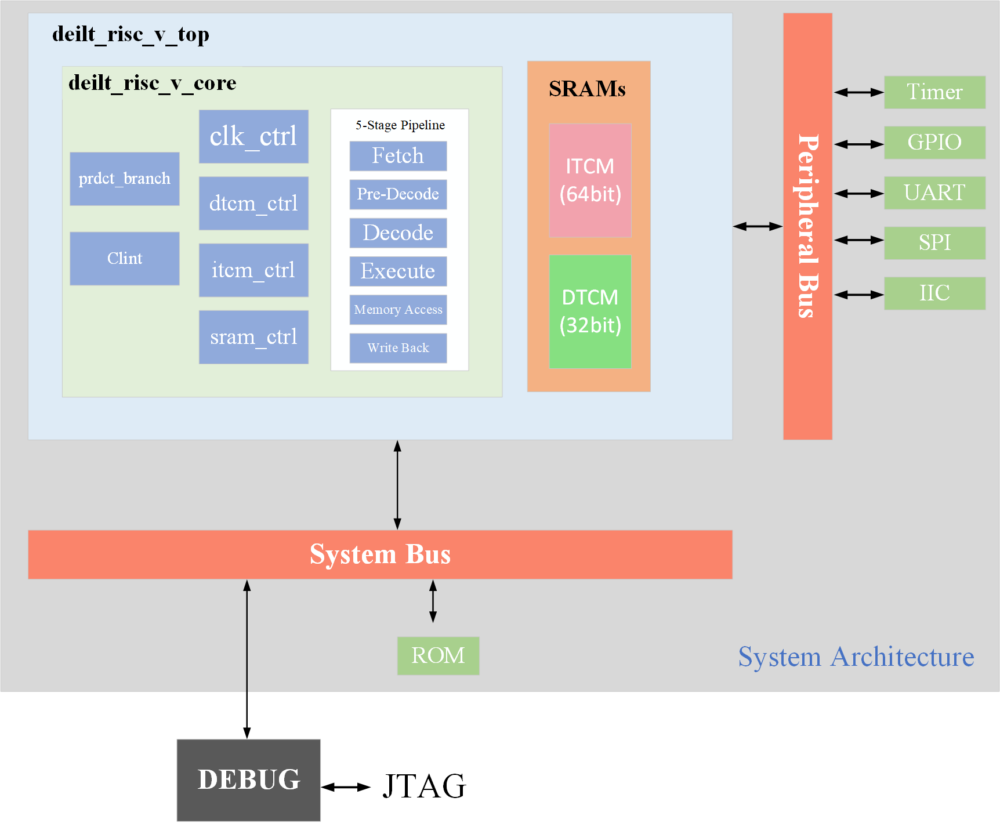

# 前言

本人目前是一个小小的硕士研究生，正在学习数字IC前端设计相关知识。创建此项目的目的是为了学习RISC-V，希望可以通过此项目的学习加深对数字IC设计的理解。代码等方面可能会有错误的地方，望大家能够谅解。


## 相关资料参考

> - 《计算机组成与设计——硬件软件接口(risc-v)》
> - 《Computer Organization and Design RISC-V edition》
> - 《手把手教你设计CPU-RISC-V处理器篇》
> - 《RISC-V架构与嵌入式开发快速入门》
> - 《The RISC-V Instruction Set Manual Volume I: Unprivileged ISA》
> - 《RISC-V 指令集手册 卷1：用户级指令集体系结构（User-Level ISA） 2.1 版》
> - 《The RISC-V Instruction Set Manual Volume II: Privileged Architecture》
> - 《RISC-V 指令集手册 卷2：特权体系结构（Privileged Architecture） 特权体系结构 1.7 版》
> - 《The RISC-V Reader中文版》
> - 《riscv-debug-spec-stable_0.13》
> - 《riscv-debug-release_0.13.2》
> - 《自制CPU入门》
> - 《自己动手写cpu》
> - [蜂鸟e203开源risc-v](https://github.com/deilt/e200_opensource)

# Deilt_RISC Introduction

设计文档请参考（记录设计时的过程，想法，及问题解决等）：[./Arch/DEILT_RISC_SPEC.md](https://github.com/deilt/Deilt_RISC/blob/main/Arch/DEILT_RISC_SPEC.md)

## 1 feature

本项目拟设计一个五级流水的单核32位处理器（Deilt_RISC），采用Verilog编写。其具有以下特点：

- 工作频率（）？
- 按序发射按序执行按序写回的五级流水线 
- 单周期 多周期？？
- 采用静态预测机制
- RV32I（40条指令）（32位通用寄存器,基础整数指令集）
- 拓展指令Ｍ，乘除拓展（4条乘法，2条除法，2条取余），试商法实现除法运算
- 仅支持机器模式（Machine Mode）
- 配备完整的ITCM 和DTCM(Sram)
- verilog 2001语法编写
- 支持中断
- 模块与模块的接口均采用严谨的 valid-ready 握手接口
- IP模块包括：中断控制器、计时器（TImer）、UART、SPI
- 支持JTAG调试，调试软件GDB
- 未完待续。。。

## 2 Architecture



## 3 工程目录文件说明

```
Deilt_RISC                                                                   
├─ Arch                                                             
├─ book                                                                                          
├─ DC                                                                                  
├─ isa                                                                                 
│  └─ rom_addi_inst_test.txt             //简单的指令测试文件                                              
├─ libs                                                                                
├─ rtl                                                                                 
│  ├─ core                              //riscv_core                                               
│  │  ├─ ex.v                           //执行模块                                               
│  │  ├─ ex_mem.v                       //ex_mem模块                                               
│  │  ├─ id.v                           //译码模块                                               
│  │  ├─ id_ex.v                                                                       
│  │  ├─ if_id.v                                                                       
│  │  ├─ mem.v                          //访存模块                                               
│  │  ├─ mem_wb.v                                                                      
│  │  ├─ pc.v                           //program counter                                               
│  │  ├─ ram.v                          //存储器                                               
│  │  ├─ regfile.v                      //32位通用寄存器                                               
│  │  ├─ riscv_core.v                   //core                                                
│  │  ├─ rom.v                          //rom，用于存储指令                                               
│  │  └─ wb.v                           //写回模块                                               
│  ├─ debug                                                                            
│  ├─ defines                           //定义文件夹                                               
│  │  └─ defines.v                                                                     
│  ├─ general                                                                          
│  │  ├─ gnrl_dffs.v                    //通用D触发器
|  |  |  ├─  gnrl_dfflrd                //with Load-enable and Reset, Default reset value is default_vlu
|  |  |  ├─  gnrl_dfflrs                //with Load-enable and Reset, Default reset value is 1
|  |  |  ├─  gnrl_dfflr                 //with Load-enable and Reset, Default reset value is 0
|  |  |  ├─  gnrl_dffl                  //with Load-enable, no reset 
|  |  |  ├─  gnrl_dffrs                 //with Reset, no load-enable ,Default reset value is 1
|  |  |  ├─  gnrl_dffr                  //with Reset, no load-enable, Default reset value is 0
|  |  |  ├─  gnrl_latch                 //general latch                       
│  │  ├─ gnrl_ram.v                     //通用SRAM                                               
│  │  ├─ gnrl_ram_2clock.v                                                             
│  │  └─ gnrl_xchecker.v                //不定态检测模块                                               
│  ├─ perips                                                                           
│  └─ soc                                                                              
├─ sdk                                                                                 
├─ sim                                                                                 
├─ tb                                                                                  
│  ├─ 20230310tb_for_i.v                                                               
│  └─ core_tb(addi).v                  //2023-3-13简单测试add的tb模块                                         
├─ tools                                                                               
├─ LICENSE                                                                             
├─ README.md                                                                           
└─ tree.tree                                                                           
```

## 4 仿真编译环境及工具

- 系统

  - CentOS Linux release 7.9.2009 (Core)

  - Linux version 3.10.0-1160.53.1.el7.x86_64


- GNU
  - gcc version 4.8.5 20150623 (Red Hat 4.8.5-44) (GCC) 
  - riscv32-unknown-elf-gcc (g) 11.1.0
  - GUN Make 4.2

- verilog编译仿真
  - Compiler version = VCS-MX O-2018.09-1
  - Release Verdi_O-2018.09-SP2 for (RH Linux x86_64/64bit)

- 其他工具
  - VIM - Vi IMproved 8.2 (2019 Dec 12, compiled May 21 2022 19:29:38)
  - TCL 8.5.13


# 进程

## 2023/03/01

>- 了解了大概的基础知识
>- 搭建了基础的架构
>- 初步确定了deilt_risc的实现功能及要求
>- 初步撰写了deilt_risc的设计文稿
>- 下一步目标是设计数据通路，从零到一实现Deilt_Risc

## 2023/03/08-03/13

>- 搭建I型指令的数据通路
>- 完成相关代码的设计
>- 完成ADD相关i型指令验证
>- 撰写设计相关文档

## 2023/03/13-2023/03/15

> - 在文档中（DEILT_RISCV_SPEC）中添加流水线冒险的情况与解决方案（03/14）
> - 完成rtl代码应对流水线冒险的功能
> - 撰写简单的流水线测试指令用于测试
> - 完成通过流水线冒险编译仿真测试

## 2023/03/15-2023/03/16

>- 在rtl中添加了R型指令相关部分
>- 完成通过了R型指令的编译仿真
>- 设计文档中添加了R型指令的说明

## 2023/03/16-2023/03/23

>- 文档中对流水线暂停，及分支预测进行了说明
>- 修改流水线数据通路图，添加了CTRL和PRDCT模块
>- 修改rtl代码，加入CREL模块和PRDCT模块
>- 指令中加入了分支跳转指令
>- 指令中加入了U型指令
>- debug
>- 完成了对I、R、U、J、B型指令的仿真测试，均通过

